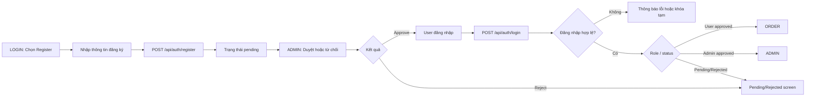

# Flow Design - AUTH-FLOW

## 1. Tổng quan luồng
- Tên luồng: Đăng ký, đăng nhập và phê duyệt tài khoản.
- Actor chính: User, Admin.
- Mục tiêu:
  - User đăng ký và đăng nhập an toàn.
  - Admin duyệt/từ chối tài khoản trong SLA 24h.
- Điểm bắt đầu: Người dùng chưa đăng nhập.
- Điểm kết thúc: User vào đúng khu vực USER hoặc ADMIN, hoặc dừng ở trạng thái chờ duyệt.

## 2. Flow diagram (Mermaid fallback)

## 3. Danh sách màn hình trong luồng

| Thứ tự | Màn hình | Mục đích | Screen spec |
|---|---|---|---|
| 1 | Login | Đăng nhập và điều hướng theo role/status | [LOGIN](../screens/LOGIN.md) |
| 2 | Admin | Duyệt/từ chối tài khoản trong khu vực Users | [ADMIN](../screens/ADMIN.md) |
| 3 | Order | Khu vực user đã duyệt sau khi đăng nhập | [ORDER](../screens/ORDER.md) |

## 4. Thiết kế tương tác (Interactions)
- Sau đăng ký thành công: toast success và chuyển sang trạng thái chờ duyệt.
- Đăng nhập sai quá ngưỡng: hiển thị khóa tạm 15 phút.
- User pending/rejected: route guard giữ ở màn hình thông báo trạng thái.
- Animation gợi ý: toast fade 160ms, modal fade 180ms.

---

Cập nhật lần cuối: 2026-04-23