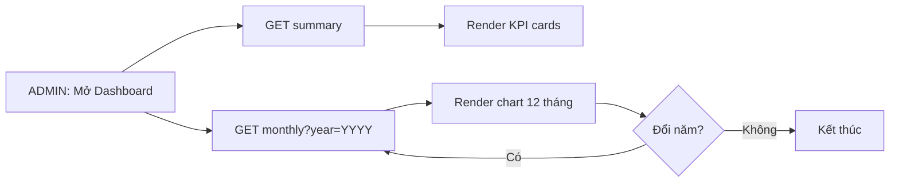

# Flow Design - DASHBOARD-FLOW

## 1. Tổng quan luồng
- Tên luồng: Xem dashboard vận hành theo tháng.
- Actor chính: Admin.
- Mục tiêu:
  - Xem KPI tổng quan và biểu đồ 12 tháng.
  - Đổi năm để phân tích dữ liệu.
- Điểm bắt đầu: Admin mở dashboard.
- Điểm kết thúc: Dữ liệu dashboard được hiển thị đúng theo năm đã chọn.

## 2. Flow diagram (Mermaid fallback)

## 3. Danh sách màn hình trong luồng

| Thứ tự | Màn hình | Mục đích | Screen spec |
|---|---|---|---|
| 1 | Dashboard | Xem KPI và chart theo tháng | [DASHBOARD](../screens/DASHBOARD.md) |
| 2 | Admin | Shell điều hướng khu vực Dashboard | [ADMIN](../screens/ADMIN.md) |

## 4. Thiết kế tương tác (Interactions)
- Khi mở dashboard: gọi summary và monthly song song.
- Đổi năm: chỉ reload monthly, giữ nguyên card summary.
- Chart rỗng: hiển thị 12 tháng với 0 để không đứt mạch phân tích.

---

Cập nhật lần cuối: 2026-04-23