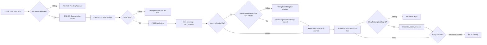

# Flow Design - ORDER-FLOW

## 1. Tổng quan luồng
- Tên luồng: Đặt món và vận hành đơn hàng.
- Actor chính: User `approved`, Admin.
- Mục tiêu:
  - User tạo đơn trước cutoff, có thể tự sửa/hủy đơn khi còn `pending`.
  - Admin theo dõi đơn realtime và cập nhật trạng thái đúng ma trận.
- Điểm bắt đầu: User đã đăng nhập thành công.
- Điểm kết thúc: Đơn ở trạng thái cuối (`delivered` hoặc `cancelled`).

## 2. Flow diagram (Mermaid fallback)

Ghi chú: Hiện chưa tích hợp MCP Figma/MCP Draw.io trong workspace, sử dụng Mermaid làm fallback theo quality gate.

## 3. Danh sách màn hình trong luồng

| Thứ tự | Màn hình | Mục đích | Screen spec |
|---|---|---|---|
| 1 | Login | Xác thực user/admin và route theo role/status | [LOGIN](../screens/LOGIN.md) |
| 2 | Order | User chọn món, tạo đơn, sửa/hủy đơn của mình | [ORDER](../screens/ORDER.md) |
| 3 | Admin | Admin theo dõi và cập nhật trạng thái đơn realtime | [ADMIN](../screens/ADMIN.md) |

## 4. Thiết kế tương tác (Interactions)
- Transition đăng nhập -> order/admin: chuyển trang tức thời sau khi nhận token hợp lệ.
- Transition đặt món thành công: toast success + row mới xuất hiện ở danh sách đơn.
- Tương tác sửa/hủy: mở modal xác nhận ngắn, chỉ bật action nếu thỏa điều kiện nghiệp vụ.
- Realtime admin: khi có `new_order` hoặc `order_status_changed`, highlight row thay đổi trong 2 giây.
- Animation gợi ý:
  - Toast slide-up 160ms.
  - Modal fade + scale nhẹ 180ms.
  - Row update pulse background 1200ms, giảm dần.

---

Cập nhật lần cuối: 2026-04-23
