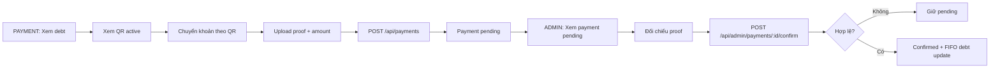

# Flow Design - PAYMENT-FLOW

## 1. Tổng quan luồng
- Tên luồng: Xem công nợ, tải bằng chứng và xác nhận thanh toán.
- Actor chính: User approved, Admin.
- Mục tiêu:
  - User thanh toán theo QR và gửi proof bắt buộc.
  - Admin xác nhận payment và cấn trừ debt theo FIFO.
- Điểm bắt đầu: User mở trang công nợ.
- Điểm kết thúc: Payment được xác nhận và debt cập nhật xong.

## 2. Flow diagram (Mermaid fallback)

## 3. Danh sách màn hình trong luồng

| Thứ tự | Màn hình | Mục đích | Screen spec |
|---|---|---|---|
| 1 | Payment | User xem debt và gửi payment request | [PAYMENT](../screens/PAYMENT.md) |
| 2 | Admin | Admin xác nhận payment ở khu vực Payments | [ADMIN](../screens/ADMIN.md) |

## 4. Thiết kế tương tác (Interactions)
- Sau khi upload proof hợp lệ: modal gửi request bật nút submit.
- Khi payment pending: history cập nhật ngay trên màn hình user.
- Khi admin confirm: trạng thái đổi sang confirmed và hiển thị toast thành công.
- Nếu proof thiếu: giữ người dùng ở modal upload, không cho submit.

---

Cập nhật lần cuối: 2026-04-23