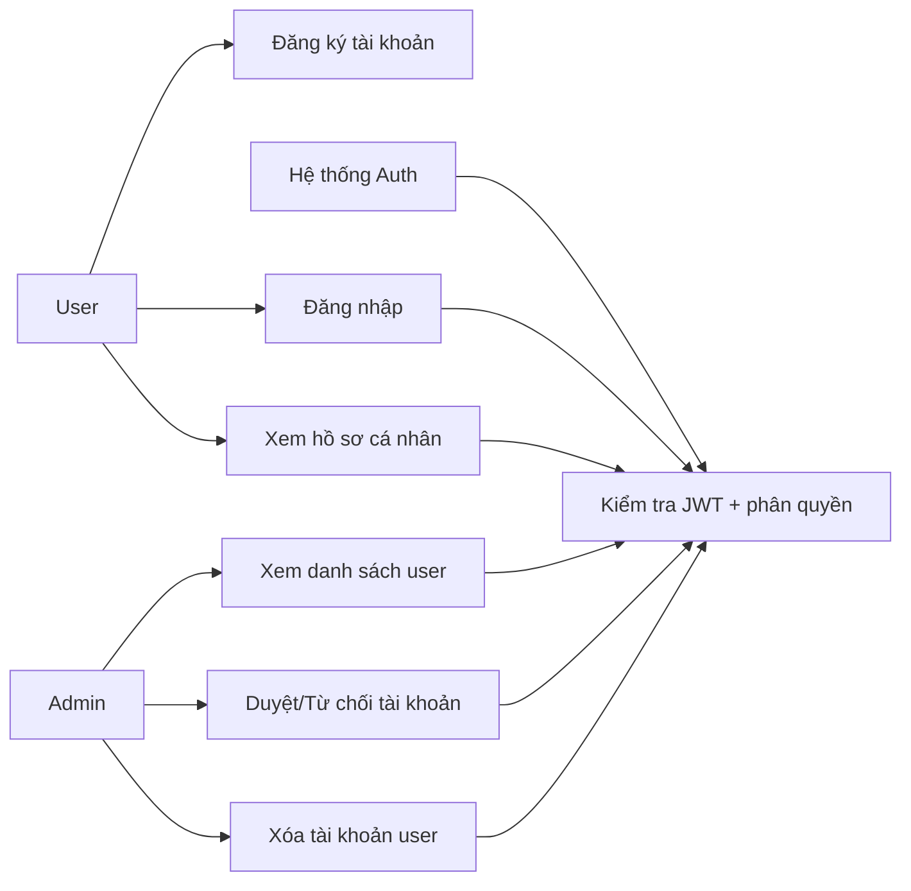
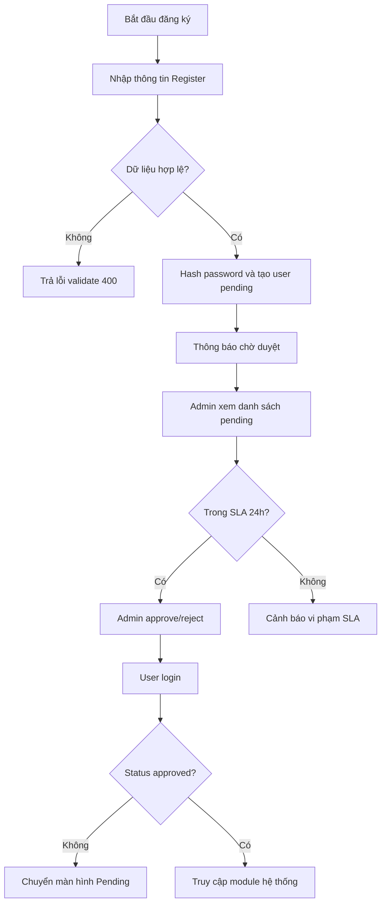
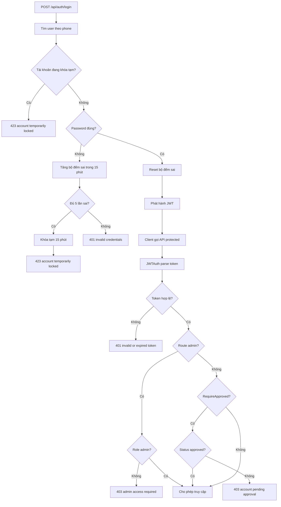
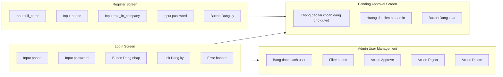

# SRS - Module Auth

## 0. Mục tiêu và phạm vi module

### 0.1 Mục tiêu
- Chuẩn hóa luồng xác thực và quản trị tài khoản nội bộ cho Lunch Order System.
- Đảm bảo chỉ người dùng hợp lệ, đúng vai trò mới truy cập được chức năng tương ứng.
- Đảm bảo SLA duyệt tài khoản tối đa 24 giờ theo quyết định nghiệp vụ đã chốt.

### 0.2 Phạm vi trong TASK-INDEX
- TASK-001: Setup database schema và migration nền tảng liên quan người dùng.
- TASK-002: API Auth gồm Register, Login, Me.
- TASK-003: Middleware JWT, role Admin/User, kiểm tra trạng thái phê duyệt.
- TASK-004: API Admin duyệt, từ chối, xóa tài khoản.
- TASK-005: UI Login/Register/Pending Approval.

### 0.3 Ngoài phạm vi module ở giai đoạn này
- Quên mật khẩu qua email/SMS OTP.
- SSO (Google/Microsoft/LDAP).
- Quản lý phiên đăng nhập đa thiết bị nâng cao.
- Audit log chi tiết cấp bảo mật cao (chỉ ghi nhận cơ bản qua dữ liệu hiện có).

### 0.4 Tài liệu đầu vào
- PRD chính: docs/prd/PRD-main.md
- User Story Sprint 1: docs/user-stories/US-Sprint-1.md
- Kiến trúc: docs/tasks/ARCHITECTURE.md
- Task Index: docs/tasks/TASK-INDEX.md
- Task module Auth: docs/tasks/modules/TASKS-auth.md

### 0.5 Tham chiếu sản phẩm tương tự (nghiên cứu web)
- Cater2.me: nhấn mạnh luồng admin cấu hình chương trình và theo dõi nhóm người dùng.
- Fooda: nhấn mạnh trải nghiệm đăng nhập nhanh và mở rộng theo địa điểm nội bộ.
- Foodsby: nhấn mạnh onboarding đơn giản, mô hình trợ cấp công ty.

## 1. Feature Specs - Đặc tả tính năng

| Mã tính năng | Tên tính năng | Mô tả | Độ ưu tiên | User story liên quan | Task liên quan |
|---|---|---|---|---|---|
| AUTH-01 | Khởi tạo dữ liệu người dùng | Tạo schema `users` và ràng buộc nền tảng xác thực | Must | US-S1-01 | TASK-001 |
| AUTH-02 | Đăng ký tài khoản | Tạo tài khoản mới ở trạng thái chờ duyệt | Must | US-S1-02 | TASK-002 |
| AUTH-03 | Đăng nhập lấy JWT | Xác thực đăng nhập, giới hạn sai 5 lần/15 phút và phát hành token | Must | US-S1-02 | TASK-002 |
| AUTH-04 | Lấy thông tin cá nhân | Trả về thông tin user hiện tại khi token hợp lệ | Must | US-S1-02 | TASK-002 |
| AUTH-05 | Middleware bảo vệ API | JWT + role + trạng thái approved/pending/rejected | Must | US-S1-03 | TASK-003 |
| AUTH-06 | Quản trị duyệt tài khoản | Admin xem danh sách, duyệt, từ chối kèm lý do, xóa user | Must | US-S1-04 | TASK-004 |
| AUTH-07 | UI Login/Register/Pending | Form xác thực, xử lý lỗi, điều hướng đúng trạng thái | Should | US-S1-05 | TASK-005 |

### AUTH-01 - Khởi tạo dữ liệu người dùng

**Điều kiện tiên quyết**
- PostgreSQL hoạt động ổn định.
- Cơ chế migration được kích hoạt từ backend startup.

**Luồng chính**
1. Backend khởi động và chạy AutoMigrate.
2. Bảng `users` được tạo nếu chưa tồn tại.
3. Ràng buộc unique cho `phone` được áp dụng.

**Luồng thay thế và ngoại lệ**
- DB không kết nối được: dừng tiến trình khởi động API.
- Migration lỗi do quyền DB: ghi log lỗi và không phục vụ request.

**Tiêu chí chấp nhận**
- Có bảng `users` với các cột bắt buộc theo model hiện tại.
- Có unique index cho `phone`.
- Migration chạy thành công trong môi trường Docker Compose.

### AUTH-02 - Đăng ký tài khoản

**Điều kiện tiên quyết**
- Endpoint public `POST /api/auth/register` sẵn sàng.

**Luồng chính**
1. User nhập `full_name`, `phone`, `password`, tùy chọn `role_in_company`.
2. Hệ thống validate dữ liệu đầu vào.
3. Hệ thống hash mật khẩu bằng bcrypt.
4. Tạo user với `status = pending`, `role = user`.
5. Trả thông báo đăng ký thành công, chờ admin duyệt.

**Luồng thay thế và ngoại lệ**
- `phone` đã tồn tại: trả `409`.
- Thiếu trường bắt buộc hoặc password quá ngắn: trả `400`.

**Tiêu chí chấp nhận**
- User mới luôn ở trạng thái `pending` ngay sau đăng ký.
- Không lưu plaintext password.
- Trả thông báo rõ ràng để người dùng biết đang chờ duyệt.

### AUTH-03 - Đăng nhập lấy JWT

**Điều kiện tiên quyết**
- User đã đăng ký và tồn tại trong DB.

**Luồng chính**
1. User gửi `phone` và `password`.
2. Hệ thống kiểm tra user theo `phone`.
3. Hệ thống kiểm tra `locked_until`; nếu thời điểm hiện tại còn nằm trong khoảng khóa tạm thì từ chối đăng nhập.
4. So khớp password bằng bcrypt.
5. Nếu sai mật khẩu, hệ thống tăng bộ đếm sai trong cửa sổ 15 phút và đánh giá ngưỡng khóa.
6. Nếu đúng mật khẩu, hệ thống reset bộ đếm sai và phát hành JWT chứa `user_id`, `role`, `status`.
7. Trả token và thông tin user.

**Luồng thay thế và ngoại lệ**
- Sai `phone` hoặc `password` (chưa chạm ngưỡng khóa): `401`.
- Đạt ngưỡng 5 lần sai trong 15 phút: khóa tạm 15 phút và trả `423`.
- Tài khoản đang trong thời gian khóa tạm: `423`.
- Lỗi ký token: `500`.

**Tiêu chí chấp nhận**
- Token hợp lệ có thời hạn theo cấu hình JWT.
- Tài khoản `pending` vẫn có thể login nhưng bị chặn ở route cần `RequireApproved`.
- Áp dụng đúng chính sách MVP: tối đa 5 lần sai trong cửa sổ 15 phút, khóa tạm 15 phút.
- Đăng nhập thành công phải reset bộ đếm sai và bỏ trạng thái khóa tạm.

### AUTH-04 - Lấy thông tin cá nhân

**Điều kiện tiên quyết**
- Có Bearer token hợp lệ.

**Luồng chính**
1. Client gọi `GET /api/auth/me` kèm token.
2. Middleware giải mã token, lấy `user_id`.
3. Hệ thống truy vấn user và trả dữ liệu hồ sơ.

**Luồng thay thế và ngoại lệ**
- Thiếu token hoặc token sai/hết hạn: `401`.
- User không tồn tại: `404`.

**Tiêu chí chấp nhận**
- Trả đúng user hiện hành theo token.
- Không lộ trường `password_hash`.

### AUTH-05 - Middleware bảo vệ API

**Điều kiện tiên quyết**
- JWT secret đã cấu hình.

**Luồng chính**
1. `JWTAuth` kiểm tra header Authorization.
2. Parse token và đưa `user_id`, `user_role`, `user_status` vào context.
3. `RequireAdmin` chặn user không phải admin.
4. `RequireApproved` chặn user chưa duyệt trên route yêu cầu.

**Luồng thay thế và ngoại lệ**
- Header không đúng định dạng Bearer: `401`.
- Role không đủ quyền: `403`.
- Status không phải `approved` (với user thường): `403`.

**Tiêu chí chấp nhận**
- Tất cả route admin chỉ truy cập được bởi role admin.
- User `pending/rejected` không dùng được route user protected.

### AUTH-06 - Quản trị duyệt tài khoản

**Điều kiện tiên quyết**
- Admin đăng nhập hợp lệ.
- User đích tồn tại trong hệ thống.

**Luồng chính**
1. Admin mở danh sách user và lọc theo `status`.
2. Admin duyệt (`approved`) hoặc từ chối (`rejected`) tài khoản.
3. Khi từ chối, admin bắt buộc nhập `reject_reason`.
4. Hệ thống cập nhật trạng thái; nếu reject thì lưu `reject_reason`, `rejected_at`.
5. Admin có thể xóa user nếu cần.
6. Hệ thống trả kết quả.

**Luồng thay thế và ngoại lệ**
- User không tồn tại: `404`.
- User thường truy cập endpoint admin: `403`.
- Reject thiếu `reject_reason`: `400`.
- Lỗi DB khi cập nhật: `500`.

**Tiêu chí chấp nhận**
- Có thể lọc danh sách theo trạng thái `pending/approved/rejected`.
- Cập nhật trạng thái thành công qua endpoint approve/reject.
- SLA nghiệp vụ: các tài khoản `pending` phải được xử lý trong vòng 24 giờ.
- Mọi thao tác reject đều lưu được lý do từ chối và có thể truy xuất lại qua API quản trị.

### AUTH-07 - UI Login/Register/Pending

**Điều kiện tiên quyết**
- Frontend truy cập được API Auth.

**Luồng chính**
1. User thao tác trên form Login hoặc Register.
2. Frontend validate cơ bản trước khi gọi API.
3. Hiển thị lỗi API nếu có.
4. Sau login thành công: lưu token, điều hướng đúng vai trò/trạng thái.
5. Nếu tài khoản chưa duyệt: hiển thị màn hình chờ duyệt.

**Luồng thay thế và ngoại lệ**
- API timeout hoặc lỗi mạng: hiển thị thông báo retry.
- Token không hợp lệ: route guard chuyển về trang login.

**Tiêu chí chấp nhận**
- Form có trạng thái loading và error rõ ràng.
- Pending screen hiển thị hướng dẫn liên hệ admin.

## 2. Flow và Use Case

### 2.1 Use Case Diagram



### 2.2 Activity Diagram - Onboarding và phê duyệt



### 2.3 Flow đăng nhập và kiểm soát truy cập



## 3. Mockup

### 3.1 Wireframe mức chức năng



### 3.2 Hành vi UI theo thành phần

| Thành phần UI | Mô tả hành vi | Validate/UI rule |
|---|---|---|
| `RegisterForm` | Gửi request register, khóa nút khi đang submit | Password tối thiểu 6 ký tự |
| `LoginForm` | Gửi login, lưu token khi thành công | Bắt buộc phone/password; hiển thị số lần sai còn lại; khóa tạm 15 phút sau 5 lần sai trong 15 phút |
| `PendingPage` | Hiển thị trạng thái chờ duyệt hoặc bị từ chối | Tài khoản `rejected` phải hiển thị `reject_reason`; không cho truy cập route nghiệp vụ |
| `UserTable` (Admin) | Hiển thị danh sách và thao tác theo user | Reject bắt buộc nhập lý do; xác nhận trước khi delete |
| `RouteGuard` | Chuyển hướng khi chưa xác thực | Token sai/hết hạn => về Login |

## 4. Mô tả dữ liệu và Validation

### 4.1 Entity chính

#### Bảng User

| Tên trường | Kiểu dữ liệu | Bắt buộc | Giá trị mặc định | Quy tắc validate | Thông báo lỗi |
|---|---|---|---|---|---|
| id | UUID | Có | gen_random_uuid() | Không nhận từ client khi tạo mới | Không hợp lệ |
| full_name | string(100) | Có | — | Không rỗng, độ dài 2-100 | Vui lòng nhập họ tên |
| phone | string(20) | Có | — | Duy nhất, chỉ số và ký tự `+` hợp lệ | Số điện thoại đã đăng ký |
| role_in_company | string(50) | Không | null | Chuỗi tự do có kiểm soát độ dài | Vai trò trong công ty không hợp lệ |
| role | string(20) | Có | `user` | Chỉ nhận `user` hoặc `admin` | Role không hợp lệ |
| status | string(20) | Có | `pending` | Chỉ nhận `pending`, `approved`, `rejected` | Trạng thái không hợp lệ |
| reject_reason | string(500)/null | Có điều kiện | null | Bắt buộc khi `status = rejected`; không rỗng; độ dài 5-500 | Vui lòng nhập lý do từ chối |
| rejected_at | datetime/null | Không | null | Có giá trị khi `status = rejected` | Thời điểm từ chối không hợp lệ |
| password_hash | string | Có | — | Lưu hash bcrypt, không trả API | Không thể xử lý mật khẩu |
| failed_login_count | integer | Có | 0 | Trong khoảng 0-5 trong cửa sổ theo dõi 15 phút | Bộ đếm đăng nhập sai không hợp lệ |
| failed_window_started_at | datetime/null | Không | null | Đánh dấu thời điểm bắt đầu cửa sổ 15 phút | Cửa sổ theo dõi login không hợp lệ |
| locked_until | datetime/null | Không | null | Khi bị khóa tạm phải > thời điểm hiện tại | Trạng thái khóa tạm không hợp lệ |
| created_at | datetime | Có | now() | Server tự sinh | — |
| updated_at | datetime | Có | now() | Server cập nhật | — |

### 4.2 Validation theo form và API

| Trường request | Endpoint | Rule bắt buộc | Ghi chú nghiệp vụ |
|---|---|---|---|
| full_name | POST /api/auth/register | required | Khuyến nghị chuẩn hóa viết hoa chữ cái đầu |
| phone | POST /api/auth/register, POST /api/auth/login | required, unique (register) | Dùng phone làm định danh đăng nhập |
| password | POST /api/auth/register, POST /api/auth/login | required, min 6 | Không log plaintext; login sai tối đa 5 lần/15 phút trước khi khóa tạm |
| reject_reason | PATCH /api/admin/users/:id/reject | required, min 5, max 500 | Bắt buộc khi từ chối tài khoản |
| status filter | GET /api/admin/users | optional | Chỉ nhận tập giá trị pending/approved/rejected |

### 4.3 Quan hệ dữ liệu
- `User` 1-N `Order`.
- `User` 1-N `Debt`.
- `User` 1-N `PaymentLog`.
- `User` 1-N `BankQR` (theo admin tạo cấu hình QR).

### 4.4 Dữ liệu nhạy cảm cần bảo vệ
- `password_hash`: chỉ lưu hash bcrypt, không trả ra API response.
- JWT token: chỉ truyền qua HTTPS trong môi trường production.
- `JWT_SECRET`: quản lý qua biến môi trường, không hardcode.

### 4.5 Business rules xác thực và phê duyệt
- Khi admin reject tài khoản, hệ thống bắt buộc lưu `reject_reason` và `rejected_at`.
- Khi admin approve lại tài khoản đã reject trước đó, hệ thống phải xóa `reject_reason` cũ để tránh hiểu nhầm trạng thái hiện hành.
- Quy tắc khóa tạm đăng nhập ở MVP: tối đa 5 lần sai trong cửa sổ 15 phút; nếu chạm ngưỡng thì khóa 15 phút.
- Trong thời gian khóa tạm, mọi yêu cầu login đều trả `423` và không kiểm tra mật khẩu.
- Login thành công phải reset `failed_login_count`, `failed_window_started_at`, `locked_until`.

## 5. API Contract mức chức năng

### 5.1 Public/Auth API

#### POST /api/auth/register
- Mục đích: Tạo tài khoản chờ duyệt.
- Request mẫu:

```json
{
  "full_name": "Nguyen Van A",
  "phone": "0901234567",
  "password": "secret123",
  "role_in_company": "backend"
}
```

- Response thành công `201`:

```json
{
  "message": "registered successfully, waiting for admin approval",
  "user": {
    "id": "uuid",
    "full_name": "Nguyen Van A",
    "phone": "0901234567",
    "role": "user",
    "status": "pending"
  }
}
```

- Error chính: `400` validate, `409` phone trùng, `500` lỗi hệ thống.

#### POST /api/auth/login
- Mục đích: Đăng nhập nhận JWT.
- Request mẫu:

```json
{
  "phone": "0901234567",
  "password": "secret123"
}
```

- Response thành công `200`:

```json
{
  "token": "jwt_string",
  "user": {
    "id": "uuid",
    "full_name": "Nguyen Van A",
    "phone": "0901234567",
    "role": "user",
    "status": "pending"
  }
}
```

- Error chính: `400` validate, `401` sai thông tin, `423` tài khoản đang bị khóa tạm, `500` lỗi ký token.

- Response lỗi khi đang khóa tạm `423`:

```json
{
  "error": "account temporarily locked",
  "retry_after_seconds": 900
}
```

#### GET /api/auth/me
- Mục đích: Lấy thông tin tài khoản hiện tại.
- Header: `Authorization: Bearer <token>`.
- Response thành công `200`: object user.
- Error chính: `401` token không hợp lệ, `404` user không tồn tại.

### 5.2 Admin User API

| Method | Endpoint | Mục đích | Request chính | Response chính | Error chính |
|---|---|---|---|---|---|
| GET | /api/admin/users?status=pending | Danh sách user theo trạng thái | Query `status` optional | Mảng user | 401, 403 |
| PATCH | /api/admin/users/:id/approve | Duyệt tài khoản | Path `id` | `{ "message": "user approved" }` | 401, 403, 404, 500 |
| PATCH | /api/admin/users/:id/reject | Từ chối tài khoản | Path `id` + body `reject_reason` | `{ "message": "user rejected", "reject_reason": "..." }` | 400, 401, 403, 404, 500 |
| DELETE | /api/admin/users/:id | Xóa tài khoản user | Path `id` | `{ "message": "user deleted" }` | 401, 403, 404, 500 |

Request mẫu `PATCH /api/admin/users/:id/reject`:

```json
{
  "reject_reason": "Thiếu thông tin phòng ban và mã nhân viên"
}
```

## 6. Ràng buộc phân quyền (Admin/User)

| Chức năng | User chưa login | User pending/rejected | User approved | Admin |
|---|---|---|---|---|
| Register/Login | Cho phép | Cho phép | Cho phép | Cho phép |
| Xem hồ sơ (`/api/auth/me`) | Không | Bị chặn nếu route yêu cầu approved | Cho phép | Cho phép |
| Truy cập API nghiệp vụ user (order, debt, payment) | Không | Không | Cho phép | Cho phép |
| Quản trị user (`/api/admin/users...`) | Không | Không | Không | Cho phép |

## 7. Tiêu chí chấp nhận module

- Hoàn thành đầy đủ endpoint Auth và Admin User trong phạm vi TASK-001 đến TASK-005.
- Route protected bắt buộc đi qua middleware JWT và kiểm soát role/status chính xác.
- Toàn bộ tài khoản đăng ký mới ở trạng thái `pending`.
- Quy trình duyệt tài khoản đáp ứng SLA tối đa 24 giờ.
- Thao tác reject tài khoản bắt buộc có lý do và lưu bền vững trong dữ liệu.
- Đăng nhập áp dụng giới hạn sai 5 lần trong 15 phút, khóa tạm 15 phút theo quyết định MVP.
- Frontend có màn hình Login, Register, Pending Approval với thông báo lỗi rõ ràng.

## 8. Giả định và phụ thuộc

- Có ít nhất một admin seed sẵn hoặc được tạo qua kênh vận hành nội bộ.
- Dịch vụ DB và backend chạy ổn định trong Docker Compose.
- `JWT_SECRET` và thời hạn token được cấu hình đúng môi trường.
- Quy trình vận hành nội bộ có người chịu trách nhiệm duyệt tài khoản hằng ngày.

## 9. Câu hỏi mở

- Đã chốt: bắt buộc lưu `reject_reason` khi admin từ chối tài khoản.
- Đã chốt: áp dụng giới hạn login sai tối đa 5 lần trong 15 phút, khóa tạm 15 phút rồi cho thử lại.
- Trạng thái hiện tại: không còn câu hỏi mở cho phạm vi Auth trong đợt cập nhật này.
