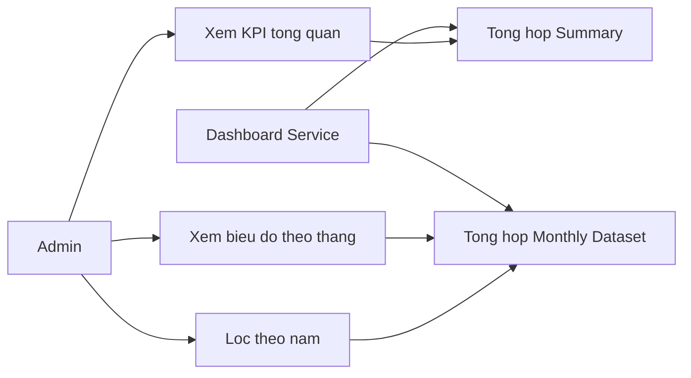
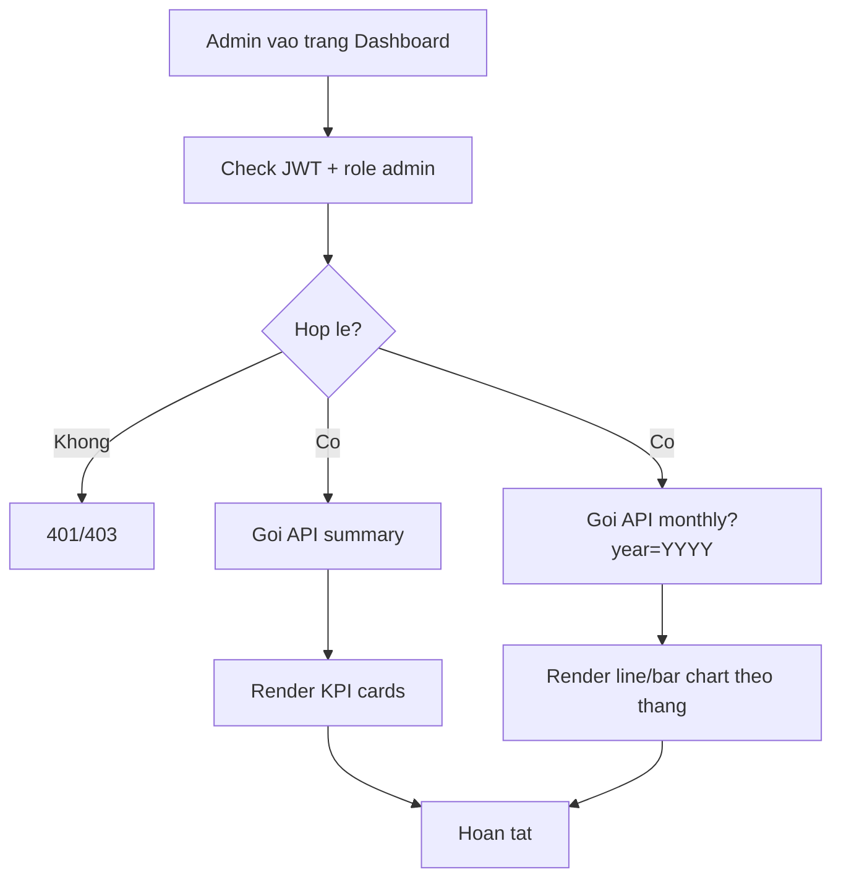
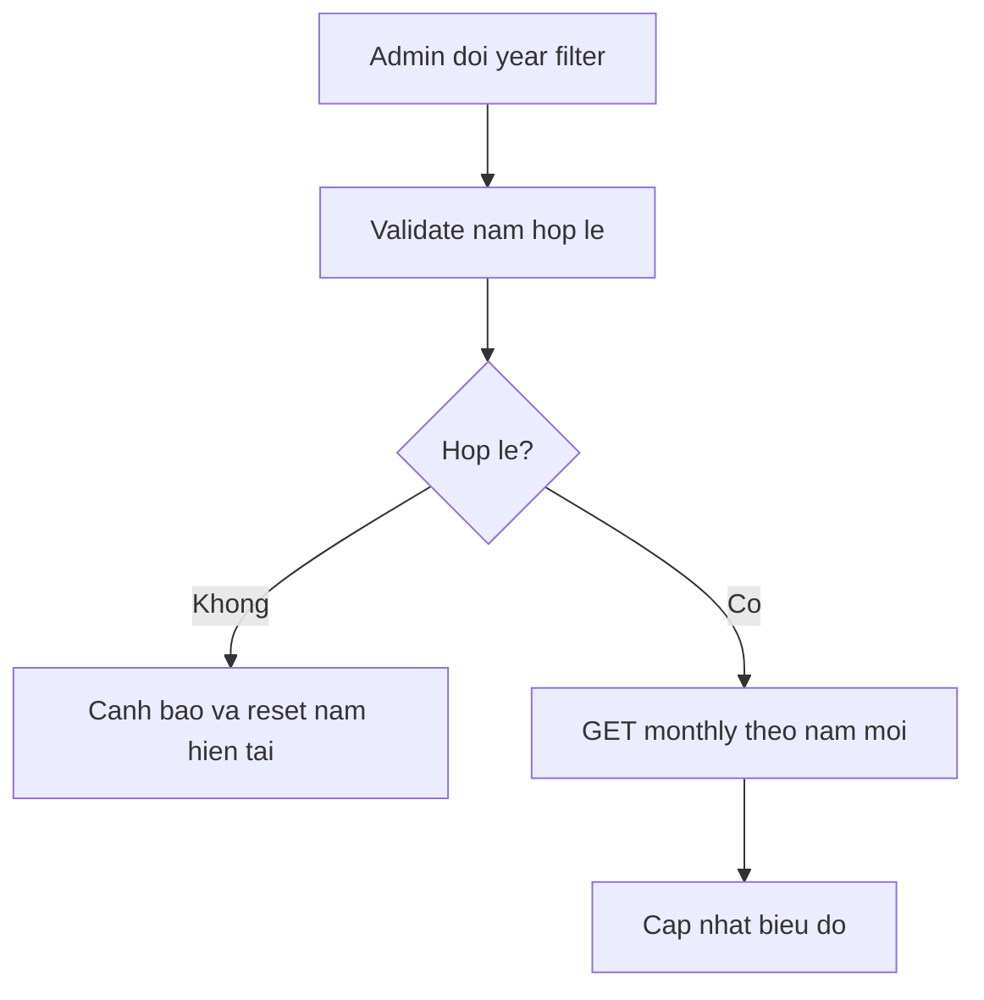
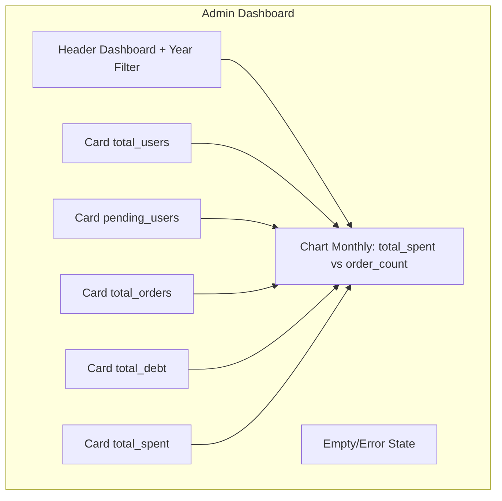

# SRS - Module Dashboard

## 0. Mục tiêu và phạm vi module

### 0.1 Mục tiêu
- Cung cấp dashboard quản trị mức cơ bản để theo dõi vận hành đặt món theo tháng.
- Tổng hợp nhanh các chỉ số cốt lõi phục vụ điều phối admin.
- Giữ nguyên bộ KPI hiện tại, không mở rộng KPI mới trong giai đoạn này.

### 0.2 Phạm vi trong TASK-INDEX
- TASK-019: API Dashboard (monthly chart, summary).
- TASK-021: Trang Dashboard Admin (chart chi tiêu).

### 0.3 Quyết định nghiệp vụ bắt buộc áp dụng
- Chưa bổ sung KPI dashboard mới ở giai đoạn hiện tại.
- Chỉ sử dụng bộ chỉ số đã xác nhận trong PRD và TASK-INDEX.

### 0.4 Ngoài phạm vi module ở giai đoạn này
- KPI nâng cao theo phòng ban/nhóm.
- Dự báo chi tiêu bằng AI/ML.
- Drill-down phân tích sâu đa chiều (vendor, món, khung giờ).

### 0.5 Tài liệu đầu vào
- docs/prd/PRD-main.md
- docs/user-stories/US-Sprint-1.md
- docs/tasks/ARCHITECTURE.md
- docs/tasks/TASK-INDEX.md
- docs/tasks/modules/TASKS-auth.md

### 0.6 Tham chiếu sản phẩm tương tự (nghiên cứu web)
- Cater2.me: dashboard vận hành theo dõi đơn và ngân sách.
- Fooda: tập trung insight mức tổng quan cho admin doanh nghiệp.
- Bài học áp dụng: dashboard MVP ưu tiên rõ ràng, ít chỉ số nhưng tin cậy.

## 1. Feature Specs - Đặc tả tính năng

| Mã tính năng | Tên tính năng | Mô tả | Độ ưu tiên | Task liên quan |
|---|---|---|---|---|
| DASH-01 | Summary KPI | Trả chỉ số tổng hợp vận hành hiện tại | Must | TASK-019 |
| DASH-02 | Monthly chart dataset | Trả dữ liệu đủ 12 tháng, tháng rỗng = 0, chuẩn timezone Asia/Ho_Chi_Minh | Must | TASK-019 |
| DASH-03 | Dashboard UI admin | Hiển thị card tổng quan + biểu đồ tháng | Must | TASK-021 |
| DASH-04 | Filter theo năm | Cho phép chọn năm xem thống kê tháng | Should | TASK-019, TASK-021 |

### DASH-01 - Summary KPI

**Điều kiện tiên quyết**
- Admin đăng nhập hợp lệ.

**Luồng chính**
1. Frontend gọi `GET /api/admin/dashboard/summary`.
2. Backend tổng hợp các chỉ số hiện tại từ bảng user/order/debt.
3. Trả dữ liệu để render thẻ KPI tổng quan.

**Luồng thay thế và ngoại lệ**
- Token không hợp lệ hoặc không phải admin: `401/403`.
- Lỗi truy vấn DB: `500`.

**Tiêu chí chấp nhận**
- Trả đủ các chỉ số đã có: `total_users`, `pending_users`, `total_orders`, `total_debt`, `total_spent`.

### DASH-02 - Monthly chart dataset

**Điều kiện tiên quyết**
- Dữ liệu order đã phát sinh trong năm cần xem.

**Luồng chính**
1. Frontend gửi `GET /api/admin/dashboard/monthly?year=YYYY`.
2. Backend group theo tháng trên timezone `Asia/Ho_Chi_Minh`, tính tổng chi trợ cấp và số đơn.
3. Backend bổ sung các tháng không có dữ liệu với giá trị `0`.
4. Trả dataset gồm đúng 12 tháng để frontend vẽ biểu đồ liên tục.

**Luồng thay thế và ngoại lệ**
- Năm không hợp lệ: `400`.
- Không có dữ liệu trong cả năm: vẫn trả đủ 12 tháng với `total_spent = 0`, `order_count = 0`.

**Tiêu chí chấp nhận**
- Dữ liệu tháng chính xác theo năm được chọn.
- Loại trừ đơn `cancelled` và đơn tự nấu khỏi `total_spent` theo logic hiện tại.
- Luôn trả đủ 12 điểm tháng (01-12), không phụ thuộc có phát sinh dữ liệu hay không.
- Chuẩn timezone thống kê cố định là `Asia/Ho_Chi_Minh`.

### DASH-03 - Dashboard UI admin

**Điều kiện tiên quyết**
- Frontend có route admin và API dashboard sẵn sàng.

**Luồng chính**
1. Admin mở trang dashboard.
2. UI gọi song song API summary và monthly.
3. Render KPI cards và biểu đồ tháng.
4. Hiển thị trạng thái loading/error tương ứng.

**Luồng thay thế và ngoại lệ**
- API lỗi: hiển thị fallback message và nút reload.

**Tiêu chí chấp nhận**
- Trang dashboard hiển thị ổn định trên desktop và mobile.
- Admin truy cập nhanh các chỉ số cốt lõi trong một màn hình.

### DASH-04 - Filter theo năm

**Điều kiện tiên quyết**
- Có control chọn năm trên giao diện.

**Luồng chính**
1. Admin chọn năm.
2. UI gọi lại API monthly theo năm mới.
3. Biểu đồ cập nhật tương ứng.

**Luồng thay thế và ngoại lệ**
- Năm ngoài khoảng hỗ trợ: hiển thị cảnh báo và dùng năm hiện tại.

**Tiêu chí chấp nhận**
- Chuyển năm không làm mất dữ liệu summary.

## 2. Flow và Use Case

### 2.1 Use Case Diagram



### 2.2 Activity Diagram - Tải dashboard



### 2.3 Activity Diagram - Đổi bộ lọc năm



## 3. Mockup

### 3.1 Wireframe mức chức năng



### 3.2 Hành vi UI theo thành phần

| Thành phần | Hành vi | Quy tắc |
|---|---|---|
| Year filter | Cho phép chọn năm thống kê | Nếu không hợp lệ thì fallback năm hiện tại |
| KPI cards | Hiển thị số tổng hợp | Làm tròn số tiền theo VND |
| Monthly chart | Hiển thị dữ liệu theo tháng | Nếu không dữ liệu, hiển thị empty state |
| Error panel | Thông báo lỗi API | Có nút tải lại |

## 4. Mô tả dữ liệu và Validation

### 4.1 Dataset Summary

| Tên trường | Kiểu dữ liệu | Bắt buộc | Giá trị mặc định | Quy tắc validate | Thông báo lỗi |
|---|---|---|---|---|---|
| total_users | integer | Có | 0 | >= 0 | Dữ liệu tổng user không hợp lệ |
| pending_users | integer | Có | 0 | >= 0 | Dữ liệu pending user không hợp lệ |
| total_orders | integer | Có | 0 | >= 0 | Dữ liệu tổng đơn không hợp lệ |
| total_debt | number | Có | 0 | >= 0 | Dữ liệu tổng nợ không hợp lệ |
| total_spent | number | Có | 0 | >= 0 | Dữ liệu tổng chi không hợp lệ |

### 4.2 Dataset Monthly

| Tên trường | Kiểu dữ liệu | Bắt buộc | Giá trị mặc định | Quy tắc validate | Thông báo lỗi |
|---|---|---|---|---|---|
| month | string(YYYY-MM) | Có | — | Đúng định dạng tháng | Dữ liệu tháng không hợp lệ |
| total_spent | number | Có | 0 | >= 0 | Dữ liệu chi tiêu tháng không hợp lệ |
| order_count | integer | Có | 0 | >= 0 | Dữ liệu số đơn tháng không hợp lệ |
| timezone | string | Có | `Asia/Ho_Chi_Minh` | Cố định theo quyết định nghiệp vụ | Timezone thống kê không hợp lệ |

### 4.3 Validation input query

| Trường | Endpoint | Rule |
|---|---|---|
| year | GET /api/admin/dashboard/monthly | Bắt buộc là số 4 chữ số, phạm vi hợp lý (ví dụ 2020-2100) |
| timezone | GET /api/admin/dashboard/monthly | Không nhận từ client; backend cố định `Asia/Ho_Chi_Minh` |

### 4.4 Business rules tính toán
- `total_spent` tháng tính từ tổng `company_subsidy` của đơn hợp lệ.
- Loại trừ đơn có `status = cancelled` khỏi thống kê chi tiêu.
- Loại trừ đơn `is_self_cook = true` khỏi chi tiêu trợ cấp món đặt.
- Chuẩn timezone khi gom nhóm theo tháng: `Asia/Ho_Chi_Minh`.
- API monthly luôn trả đủ 12 tháng từ `YYYY-01` đến `YYYY-12`; tháng không có dữ liệu được điền `0`.
- Không thêm KPI mới ngoài các chỉ số đã có.

## 5. API Contract mức chức năng

### 5.1 Dashboard API (Admin only)

| Method | Endpoint | Mục đích | Request chính | Response chính | Error chính |
|---|---|---|---|---|---|
| GET | /api/admin/dashboard/summary | Trả KPI tổng quan | — | Object summary | 401, 403, 500 |
| GET | /api/admin/dashboard/monthly?year=2026 | Trả dữ liệu biểu đồ theo tháng | Query `year` | Object monthly stat gồm timezone + mảng 12 tháng | 400, 401, 403, 500 |

Response mẫu `GET /api/admin/dashboard/summary`:

```json
{
  "total_users": 120,
  "pending_users": 7,
  "total_orders": 1940,
  "total_debt": 15300000,
  "total_spent": 58100000
}
```

Response mẫu `GET /api/admin/dashboard/monthly?year=2026`:

```json
{
  "year": 2026,
  "timezone": "Asia/Ho_Chi_Minh",
  "months": [
    {
      "month": "2026-01",
      "total_spent": 8200000,
      "order_count": 320
    },
    {
      "month": "2026-02",
      "total_spent": 7900000,
      "order_count": 305
    },
    {
      "month": "2026-03",
      "total_spent": 0,
      "order_count": 0
    }
  ]
}
```

Quy ước response monthly:
- Trường `months` luôn có đúng 12 phần tử từ tháng 01 đến tháng 12.
- Các tháng không phát sinh dữ liệu có `total_spent = 0` và `order_count = 0`.

## 6. Ràng buộc phân quyền (Admin/User)

| Chức năng | User | Admin |
|---|---|---|
| Xem dashboard summary | Không | Có |
| Xem dashboard monthly | Không | Có |
| Thay đổi filter năm | Không | Có |

## 7. Tiêu chí chấp nhận module

- API summary và monthly hoạt động đúng theo dữ liệu thực tế.
- Dashboard UI admin hiển thị được KPI cards và biểu đồ theo tháng.
- Biểu đồ tháng luôn có đủ 12 tháng với giá trị 0 cho tháng không dữ liệu.
- Filter năm hoạt động, phản hồi nhanh và xử lý empty/error state rõ ràng.
- Kết quả thống kê theo tháng sử dụng nhất quán timezone `Asia/Ho_Chi_Minh`.
- Không phát sinh KPI ngoài phạm vi đã chốt ở PRD.

## 8. Giả định và phụ thuộc

- Dữ liệu từ module User/Order/Debt/Payment đã có và nhất quán.
- Chu kỳ thống kê dùng theo năm dương lịch.
- Quy tắc loại trừ đơn cancelled và self-cook được giữ ổn định trong backend.

## 9. Câu hỏi mở

- Đã chốt: biểu đồ tháng hiển thị đủ 12 tháng; tháng không có dữ liệu thì giá trị bằng 0.
- Đã chốt: timezone thống kê chuẩn là `Asia/Ho_Chi_Minh`.
- Trạng thái hiện tại: không còn câu hỏi mở cho phạm vi Dashboard trong đợt cập nhật này.
