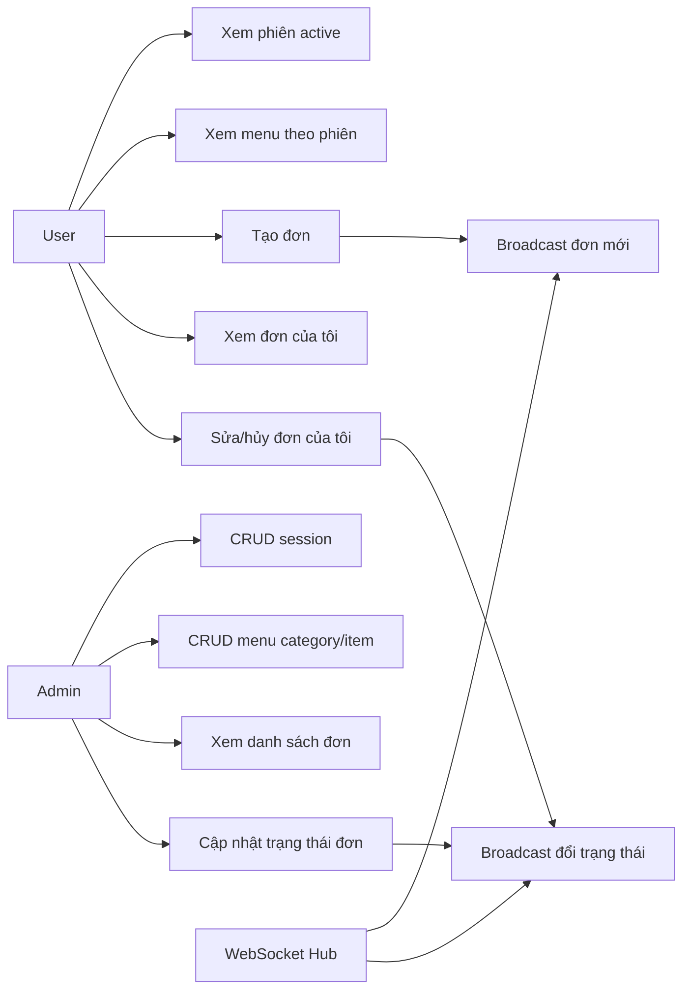
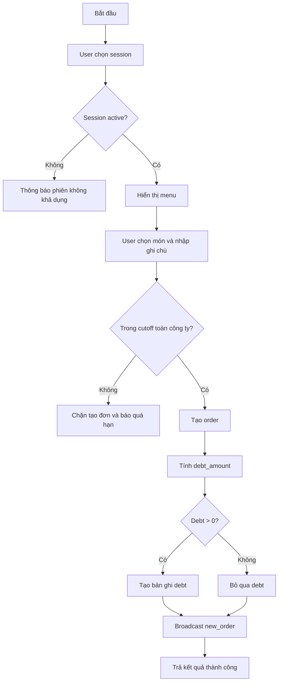
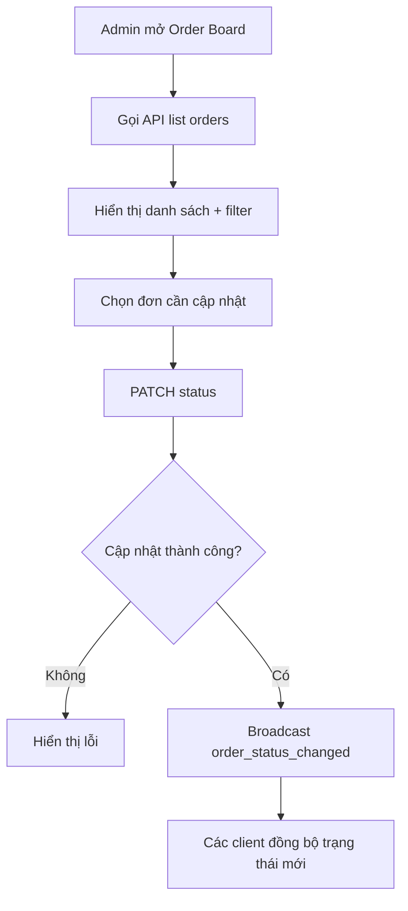
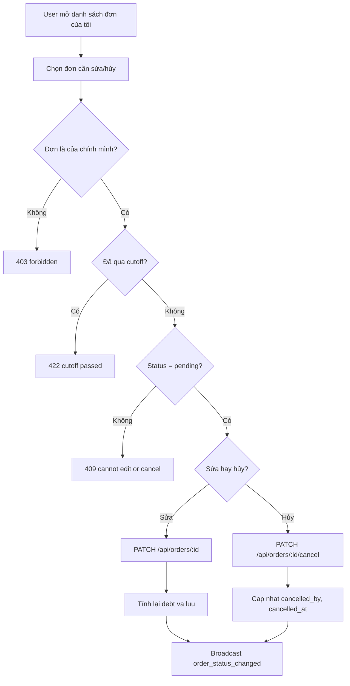
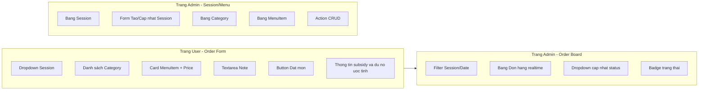

# SRS - Module Order

## 0. Mục tiêu và phạm vi module

### 0.1 Mục tiêu
- Chuẩn hóa quy trình tạo phiên ăn, quản lý menu và đặt món cho toàn công ty.
- Đảm bảo người dùng đặt món đúng hạn chót cố định toàn công ty.
- Cung cấp cập nhật realtime để admin theo dõi đơn mới và trạng thái đơn.

### 0.2 Phạm vi trong TASK-INDEX
- TASK-008: API Meal Sessions (CRUD).
- TASK-009: API Menu Category + Item (CRUD).
- TASK-010: API Orders (tạo đơn, xem đơn, đổi trạng thái).
- TASK-011: WebSocket broadcast đơn mới.
- TASK-012: Trang đặt món user.
- TASK-013: WebSocket client nhận thông báo realtime.
- TASK-014: Trang admin quản lý sessions + menu.
- TASK-015: Trang admin quản lý trạng thái đơn.

### 0.3 Quyết định nghiệp vụ bắt buộc áp dụng
- Hạn chót đặt món là cố định toàn công ty.
- Trợ cấp công ty áp dụng chung cho toàn bộ người dùng.

### 0.4 Ngoài phạm vi module ở giai đoạn này
- Thuật toán gợi ý món ăn cá nhân hóa.
- Tích hợp nhiều nhà cung cấp ngoài hệ thống nội bộ.
- Tối ưu tuyến giao hàng hoặc quản lý kho.

### 0.5 Tài liệu đầu vào
- docs/prd/PRD-main.md
- docs/user-stories/US-Sprint-1.md
- docs/tasks/ARCHITECTURE.md
- docs/tasks/TASK-INDEX.md
- docs/tasks/modules/TASKS-auth.md

### 0.6 Tham chiếu sản phẩm tương tự (nghiên cứu web)
- Foodsby: mẫu flow đặt món với cutoff rõ ràng (order trước giờ chốt).
- Cater2.me: mẫu quản lý ngân sách/trợ cấp và theo dõi đơn theo nhóm.
- Fooda: mẫu trải nghiệm lựa chọn thực đơn theo ngày và thao tác nhanh.

## 1. Feature Specs - Đặc tả tính năng

| Mã tính năng | Tên tính năng | Mô tả | Độ ưu tiên | User story liên quan | Task liên quan |
|---|---|---|---|---|---|
| ORDER-01 | Quản lý Meal Session | Admin CRUD phiên ăn | Must | Mở rộng sau Sprint 1 | TASK-008 |
| ORDER-02 | Quản lý Menu | Admin CRUD nhóm món và món theo phiên | Must | Mở rộng sau Sprint 1 | TASK-009 |
| ORDER-03 | User xem phiên hoạt động và menu | User lấy danh sách phiên active + menu | Must | Mở rộng sau Sprint 1 | TASK-010, TASK-012 |
| ORDER-04 | Tạo đơn đặt món | User tạo đơn trước deadline cố định, cho phép nhiều đơn trong cùng session | Must | Mở rộng sau Sprint 1 | TASK-010, TASK-012 |
| ORDER-05 | Quản lý trạng thái đơn | Admin xem toàn bộ đơn và cập nhật trạng thái theo ma trận đã chốt | Must | Mở rộng sau Sprint 1 | TASK-010, TASK-015 |
| ORDER-06 | Realtime đơn hàng | Broadcast đơn mới và trạng thái đơn qua WebSocket | Should | Mở rộng sau Sprint 1 | TASK-011, TASK-013 |
| ORDER-07 | UI admin vận hành order | Trang quản trị session/menu/order board | Should | Mở rộng sau Sprint 1 | TASK-014, TASK-015 |
| ORDER-08 | User tự chỉnh sửa/hủy đơn | User sửa/hủy đơn của chính mình trước cutoff khi đơn ở trạng thái ban đầu | Must | Mở rộng sau Sprint 1 | TASK-010, TASK-012 |

### ORDER-01 - Quản lý Meal Session

**Điều kiện tiên quyết**
- Admin đã đăng nhập và có quyền truy cập endpoint admin.

**Luồng chính**
1. Admin tạo phiên ăn với thông tin tên phiên, khung thời gian, mức trợ cấp.
2. Admin cập nhật phiên khi cần thay đổi vận hành.
3. Admin đóng hoặc xóa phiên không còn sử dụng.
4. User chỉ nhìn thấy phiên `is_active = true`.

**Luồng thay thế và ngoại lệ**
- Thiếu dữ liệu bắt buộc: `400`.
- Phiên không tồn tại khi cập nhật/xóa: `404`.

**Tiêu chí chấp nhận**
- CRUD phiên hoạt động ổn định.
- User endpoint chỉ trả phiên active.

### ORDER-02 - Quản lý Menu

**Điều kiện tiên quyết**
- Đã có session hợp lệ.

**Luồng chính**
1. Admin tạo category cho session.
2. Admin tạo món trong category.
3. Admin cập nhật/xóa category hoặc món.
4. User xem menu theo session.

**Luồng thay thế và ngoại lệ**
- Session/category không tồn tại: `404`.
- Dữ liệu món không hợp lệ (giá âm, thiếu tên): `400`.

**Tiêu chí chấp nhận**
- Menu hiển thị đúng theo session.
- Thứ tự category hỗ trợ qua `display_order`.

### ORDER-03 - User xem phiên active và menu

**Điều kiện tiên quyết**
- User đã đăng nhập và trạng thái `approved`.

**Luồng chính**
1. User gọi `GET /api/sessions/active`.
2. User chọn session và gọi `GET /api/sessions/:id/menu`.
3. Hệ thống trả danh sách category và item khả dụng.

**Luồng thay thế và ngoại lệ**
- Tài khoản chưa duyệt: `403`.
- Session không tồn tại: `404`.

**Tiêu chí chấp nhận**
- User thấy đúng menu của phiên được chọn.

### ORDER-04 - Tạo đơn đặt món

**Điều kiện tiên quyết**
- User `approved`.
- Session còn trong khoảng thời gian cho phép đặt món theo quy định cutoff toàn công ty.
- Menu item còn khả dụng.
- Không áp dụng ràng buộc 1 đơn/session/user ở mức nghiệp vụ.

**Luồng chính**
1. User chọn session và món.
2. User nhập ghi chú (nếu có) và xác nhận đặt.
3. Hệ thống snapshot `item_price`, `company_subsidy` tại thời điểm tạo đơn.
4. Hệ thống tính `debt_amount = max(item_price - company_subsidy, 0)`.
5. Nếu debt > 0, tạo bản ghi công nợ tương ứng.
6. Trả thông tin đơn và debt_amount.

**Luồng thay thế và ngoại lệ**
- Quá hạn chót đặt món: `422`.
- Session hoặc item không tồn tại: `404`.
- Dữ liệu gửi lên thiếu trường bắt buộc: `400`.

**Tiêu chí chấp nhận**
- Mọi đơn thành công đều lưu snapshot giá/trợ cấp.
- Debt tự động phát sinh đúng công thức.
- Không cho đặt sau cutoff cố định toàn công ty.
- Một user có thể tạo nhiều đơn trong cùng một session nếu vẫn còn trước cutoff.

### ORDER-05 - Quản lý trạng thái đơn

**Điều kiện tiên quyết**
- Admin đăng nhập hợp lệ.

**Luồng chính**
1. Admin xem danh sách đơn theo bộ lọc session/date.
2. Admin cập nhật trạng thái đơn theo ma trận chuyển trạng thái đã chốt.
3. Hệ thống kiểm tra chuyển trạng thái có hợp lệ không.
4. Hệ thống lưu trạng thái mới.

**Luồng thay thế và ngoại lệ**
- ID đơn không tồn tại: `404`.
- Trạng thái không hợp lệ: `400`.
- Chuyển trạng thái sai ma trận: `409`.

**Tiêu chí chấp nhận**
- Cập nhật trạng thái thành công và phản ánh ngay trên giao diện quản trị.
- Đơn ở trạng thái `delivered` hoặc `cancelled` là trạng thái cuối, không cho chuyển tiếp.

### ORDER-06 - Realtime đơn hàng

**Điều kiện tiên quyết**
- WebSocket hub hoạt động.
- Client đã kết nối `/ws`.

**Luồng chính**
1. Khi có đơn mới, hệ thống broadcast sự kiện `new_order`.
2. Khi đổi trạng thái đơn, broadcast `order_status_changed`.
3. Client admin nhận sự kiện và refresh danh sách cục bộ.

**Luồng thay thế và ngoại lệ**
- WebSocket mất kết nối: fallback bằng polling thủ công API list.

**Tiêu chí chấp nhận**
- Admin nhận thông báo đơn mới theo thời gian thực.
- Trạng thái đơn cập nhật realtime cho màn hình vận hành.

### ORDER-07 - UI quản trị và đặt món

**Điều kiện tiên quyết**
- Frontend đã có route guard auth.

**Luồng chính**
1. User thao tác trên trang đặt món, thấy menu theo session.
2. Admin thao tác trên trang quản lý session/menu.
3. Admin thao tác trên order board để đổi trạng thái.

**Luồng thay thế và ngoại lệ**
- Lỗi API: hiển thị thông báo, cho phép retry.

**Tiêu chí chấp nhận**
- User hoàn tất đặt món tối đa 3 bước.
- Admin quản lý session/menu/order trên các màn hình chuyên biệt.

### ORDER-08 - User tự chỉnh sửa/hủy đơn

**Điều kiện tiên quyết**
- User đã đăng nhập và `approved`.
- User là chủ sở hữu đơn.

**Luồng chính**
1. User mở danh sách đơn của mình và chọn đơn cần chỉnh sửa/hủy.
2. Hệ thống kiểm tra điều kiện: đơn thuộc user hiện hành, chưa qua cutoff và `status = pending`.
3. Với chỉnh sửa: user cập nhật món hoặc ghi chú, hệ thống cập nhật snapshot giá/trợ cấp và tính lại `debt_amount`.
4. Với hủy: hệ thống chuyển `status = cancelled`, lưu `cancelled_by = user`, `cancelled_at`.
5. Hệ thống phát sự kiện realtime để admin đồng bộ màn hình vận hành.

**Luồng thay thế và ngoại lệ**
- Đơn không thuộc user hiện hành: `403`.
- Đơn không tồn tại: `404`.
- Đã qua cutoff: `422`.
- Đơn không còn ở trạng thái ban đầu `pending`: `409`.

**Tiêu chí chấp nhận**
- User chỉ được sửa/hủy đơn của chính mình khi còn trước cutoff và đơn còn `pending`.
- Khi admin đã xử lý sâu (đơn khác `pending`) thì user không còn quyền sửa/hủy.

## 2. Flow và Use Case

### 2.1 Use Case Diagram



### 2.2 Activity Diagram - User đặt món



### 2.3 Activity Diagram - Admin vận hành đơn



### 2.4 Activity Diagram - User sửa/hủy đơn của mình



## 3. Mockup

### 3.1 Wireframe mức chức năng



### 3.2 Hành vi UI theo thành phần

| Thành phần | Hành vi | Quy tắc |
|---|---|---|
| Session selector | Chỉ hiển thị session active | Không hiển thị session đã đóng |
| Menu item card | Hiển thị tên món, giá, trạng thái | Nếu `is_available = false` thì disable |
| Submit order button | Gửi lệnh tạo đơn | Disable khi quá cutoff hoặc thiếu dữ liệu |
| My orders actions | Hiển thị nút sửa/hủy đơn của tôi | Chỉ hiển thị khi đơn `pending` và chưa qua cutoff |
| Admin order table | Cập nhật realtime khi có sự kiện WS | Có fallback refresh thủ công |
| Status control | Cho phép đổi trạng thái đơn | Chỉ admin thao tác được |

## 4. Mô tả dữ liệu và Validation

### 4.1 Entity MealSession

| Tên trường | Kiểu dữ liệu | Bắt buộc | Giá trị mặc định | Quy tắc validate | Thông báo lỗi |
|---|---|---|---|---|---|
| id | UUID | Có | gen_random_uuid() | Server tự sinh | — |
| name | string(100) | Có | — | Không rỗng, 3-100 ký tự | Tên phiên không hợp lệ |
| description | string | Không | null | Tối đa 500 ký tự | Mô tả quá dài |
| company_subsidy | number | Có | 0 | >= 0, áp dụng chung theo chính sách công ty | Trợ cấp không hợp lệ |
| start_time | HH:mm | Có | — | Đúng định dạng giờ | Giờ bắt đầu không hợp lệ |
| end_time | HH:mm | Có | — | > start_time | Giờ kết thúc không hợp lệ |
| schedule_type | enum | Có | — | `daily`, `weekly`, `once` | Kiểu lịch không hợp lệ |
| day_of_week | string/json | Không | null | Nếu weekly phải có giá trị | Thiếu ngày áp dụng |
| start_date | date | Có | — | Không nhỏ hơn ngày hiện tại khi tạo mới | Ngày bắt đầu không hợp lệ |
| end_date | date | Không | null | >= start_date | Ngày kết thúc không hợp lệ |
| is_active | boolean | Có | true | — | — |

### 4.2 Entity MenuCategory

| Tên trường | Kiểu dữ liệu | Bắt buộc | Giá trị mặc định | Quy tắc validate | Thông báo lỗi |
|---|---|---|---|---|---|
| id | UUID | Có | gen_random_uuid() | Server tự sinh | — |
| session_id | UUID | Có | — | Phải tham chiếu session tồn tại | Session không tồn tại |
| name | string(100) | Có | — | Không rỗng | Tên nhóm món không hợp lệ |
| display_order | int | Không | 0 | >= 0 | Thứ tự hiển thị không hợp lệ |

### 4.3 Entity MenuItem

| Tên trường | Kiểu dữ liệu | Bắt buộc | Giá trị mặc định | Quy tắc validate | Thông báo lỗi |
|---|---|---|---|---|---|
| id | UUID | Có | gen_random_uuid() | Server tự sinh | — |
| category_id | UUID | Có | — | Category tồn tại | Nhóm món không tồn tại |
| name | string(200) | Có | — | Không rỗng, tối đa 200 ký tự | Tên món không hợp lệ |
| price | number | Có | — | > 0 | Giá món phải lớn hơn 0 |
| is_available | boolean | Có | true | — | — |

### 4.4 Entity Order

| Tên trường | Kiểu dữ liệu | Bắt buộc | Giá trị mặc định | Quy tắc validate | Thông báo lỗi |
|---|---|---|---|---|---|
| id | UUID | Có | gen_random_uuid() | Server tự sinh | — |
| user_id | UUID | Có | — | User approved mới được tạo đơn | Tài khoản chưa được duyệt |
| session_id | UUID | Có | — | Session active và còn trong cutoff | Phiên không khả dụng hoặc quá hạn |
| menu_item_id | UUID/null | Có điều kiện | null | Bắt buộc nếu không tự nấu | Vui lòng chọn món |
| is_self_cook | boolean | Có | false | true thì cho phép menu_item_id null | Dữ liệu tự nấu không hợp lệ |
| status | enum | Có | pending | `pending`, `confirmed`, `shipping`, `delivered`, `cancelled` | Trạng thái đơn không hợp lệ |
| note | string | Không | null | Tối đa 500 ký tự | Ghi chú quá dài |
| item_price | number | Có | 0 | Snapshot giá lúc đặt | — |
| company_subsidy | number | Có | 0 | Snapshot trợ cấp tại thời điểm đặt | — |
| debt_amount | number | Có | 0 | `max(item_price - company_subsidy, 0)` | Công nợ tính sai |
| cancelled_by | enum/null | Không | null | Khi `status = cancelled` chỉ nhận `user` hoặc `admin` | Người hủy đơn không hợp lệ |
| cancelled_at | datetime/null | Không | null | Bắt buộc khi `status = cancelled` | Thời điểm hủy đơn không hợp lệ |
| order_date | datetime | Có | now() | Server tự sinh | — |
| updated_at | datetime | Có | now() | Server tự cập nhật | — |

### 4.5 Quan hệ dữ liệu và business rules
- `MealSession` 1-N `MenuCategory`.
- `MenuCategory` 1-N `MenuItem`.
- `User` 1-N `Order`.
- `Order` có thể phát sinh 1 bản ghi `Debt` khi `debt_amount > 0`.
- Quy tắc cutoff: deadline áp dụng cố định toàn công ty.
- Quy tắc trợ cấp: dùng mức trợ cấp chung theo chính sách đã chốt.
- Một `User` được tạo nhiều `Order` trong cùng một `MealSession`; không ràng buộc unique `(user_id, session_id)`.
- Ma trận trạng thái admin:
  - `pending -> confirmed | cancelled`
  - `confirmed -> shipping | cancelled`
  - `shipping -> delivered`
  - `delivered` và `cancelled` là trạng thái cuối.
- Ma trận hành động user trên đơn của mình:
  - Cho phép chỉnh sửa nội dung đơn khi `status = pending` và chưa qua cutoff (trạng thái giữ `pending`).
  - Cho phép hủy đơn khi `status = pending` và chưa qua cutoff (`pending -> cancelled`).
  - Từ chối mọi thao tác sửa/hủy khi đơn đã qua cutoff hoặc `status != pending`.

## 5. API Contract mức chức năng

### 5.1 User API

| Method | Endpoint | Mục đích | Request chính | Response chính | Error chính |
|---|---|---|---|---|---|
| GET | /api/sessions/active | Lấy phiên đang hoạt động | — | Mảng session + menu lồng | 401, 403 |
| GET | /api/sessions/:id/menu | Lấy menu theo session | Path `id` | Mảng category/items | 401, 403, 404 |
| POST | /api/orders | Tạo đơn đặt món | `session_id`, `menu_item_id`, `is_self_cook`, `note` | `order`, `debt_amount` | 400, 401, 403, 404, 422 |
| PATCH | /api/orders/:id | User chỉnh sửa đơn của mình | `menu_item_id`, `is_self_cook`, `note` | Object order đã cập nhật | 400, 401, 403, 404, 409, 422 |
| PATCH | /api/orders/:id/cancel | User hủy đơn của mình | `cancel_reason` optional | Object order `cancelled` | 401, 403, 404, 409, 422 |
| GET | /api/orders/my | Danh sách đơn của user | Query tùy chọn | Mảng order | 401, 403 |

Request mẫu `POST /api/orders`:

```json
{
  "session_id": "uuid",
  "menu_item_id": "uuid",
  "is_self_cook": false,
  "note": "It com"
}
```

Response mẫu thành công:

```json
{
  "order": {
    "id": "uuid",
    "status": "pending",
    "item_price": 55000,
    "company_subsidy": 30000,
    "debt_amount": 25000
  },
  "debt_amount": 25000
}
```

Lưu ý nghiệp vụ cho `POST /api/orders`:
- Cho phép user tạo nhiều đơn trong cùng một session khi còn trước cutoff.

Request mẫu `PATCH /api/orders/:id/cancel`:

```json
{
  "cancel_reason": "Doi lich hop, khong an trua"
}
```

Response mẫu `PATCH /api/orders/:id/cancel`:

```json
{
  "id": "uuid",
  "status": "cancelled",
  "cancelled_by": "user",
  "cancelled_at": "2026-04-23T10:25:00+07:00"
}
```

### 5.2 Admin API

| Method | Endpoint | Mục đích |
|---|---|---|
| GET | /api/admin/sessions | Danh sách phiên |
| POST | /api/admin/sessions | Tạo phiên |
| PUT | /api/admin/sessions/:id | Cập nhật phiên |
| DELETE | /api/admin/sessions/:id | Xóa phiên |
| POST | /api/admin/sessions/:id/categories | Tạo category |
| PUT | /api/admin/categories/:id | Cập nhật category |
| DELETE | /api/admin/categories/:id | Xóa category |
| POST | /api/admin/categories/:id/items | Tạo món |
| PUT | /api/admin/items/:id | Cập nhật món |
| DELETE | /api/admin/items/:id | Xóa món |
| GET | /api/admin/orders | Danh sách đơn toàn hệ thống |
| PATCH | /api/admin/orders/:id/status | Cập nhật trạng thái đơn |

Rule cho `PATCH /api/admin/orders/:id/status`:
- Chỉ cho phép chuyển theo ma trận trạng thái tại mục business rules.
- Trả `409` nếu yêu cầu chuyển trạng thái không hợp lệ.

Request mẫu `PATCH /api/admin/orders/:id/status`:

```json
{
  "status": "confirmed"
}
```

Response mẫu thành công:

```json
{
  "message": "status updated",
  "status": "confirmed"
}
```

### 5.3 WebSocket contract

| Endpoint | Event | Payload chính | Mục đích |
|---|---|---|---|
| /ws | `new_order` | object order | Thông báo có đơn mới |
| /ws | `order_status_changed` | `order_id`, `status` | Đồng bộ đổi trạng thái |

## 6. Ràng buộc phân quyền (Admin/User)

| Chức năng | User pending/rejected | User approved | Admin |
|---|---|---|---|
| Xem session active/menu | Không | Có | Có |
| Tạo đơn / sửa đơn / hủy đơn / xem đơn của tôi | Không | Có (chỉ trên đơn của chính mình và theo điều kiện cutoff + trạng thái) | Có |
| CRUD session/menu | Không | Không | Có |
| Xem và cập nhật toàn bộ đơn | Không | Không | Có |
| Kết nối ws để theo dõi vận hành | Tùy route bảo vệ của frontend | Có | Có |

## 7. Tiêu chí chấp nhận module

- Hoàn thành API và UI trong phạm vi TASK-008 đến TASK-015.
- User đặt món thành công trong hạn cutoff; sau cutoff bị chặn đúng rule.
- Hỗ trợ nhiều đơn cho cùng user trong cùng session, đúng quyết định nghiệp vụ đã chốt.
- User tự sửa/hủy đơn của mình chỉ khi đơn còn `pending` và chưa qua cutoff.
- Trợ cấp và công nợ được tính tự động, nhất quán theo chính sách chung.
- Admin cập nhật trạng thái đơn thành công và các client nhận realtime.
- Ma trận trạng thái đơn được thực thi nhất quán, không cho chuyển sai vòng đời.
- Giao diện user/admin phản ánh đúng dữ liệu backend và xử lý lỗi rõ ràng.

## 8. Giả định và phụ thuộc

- Module Auth đã hoàn tất và hoạt động ổn định (JWT, role, approval).
- Cấu hình timezone hệ thống được thống nhất để tính cutoff.
- Dữ liệu menu được admin cập nhật đầy đủ trước giờ đặt món.
- Hạ tầng WebSocket ổn định để phục vụ realtime.

## 9. Câu hỏi mở

- Đã chốt: một user được tạo nhiều đơn trong cùng một session.
- Đã chốt: user được tự chỉnh sửa/hủy đơn của chính mình khi đơn còn `pending` và chưa qua cutoff.
- Đã chốt: sau khi admin đã xử lý sâu (đơn khác `pending`) thì user không còn quyền sửa/hủy.
- Trạng thái hiện tại: không còn câu hỏi mở cho phạm vi Order trong đợt cập nhật này.
