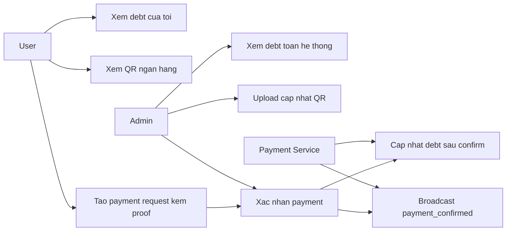
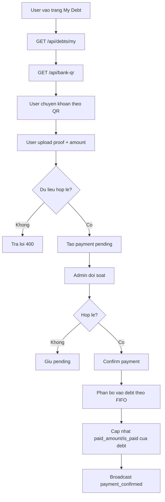
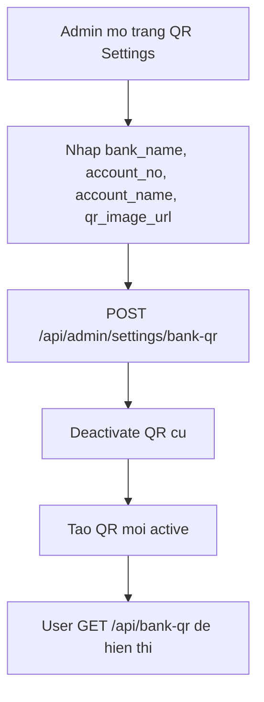

# SRS - Module Payment

## 0. Mục tiêu và phạm vi module

### 0.1 Mục tiêu
- Minh bạch công nợ người dùng phát sinh từ đơn đặt món.
- Chuẩn hóa luồng thanh toán QR có bằng chứng bắt buộc trước khi admin xác nhận.
- Đảm bảo dữ liệu thanh toán đồng bộ với trạng thái công nợ.

### 0.2 Phạm vi trong TASK-INDEX
- TASK-016: API Debt (tính nợ tự động, xem danh sách).
- TASK-017: API Payment (tạo lệnh thanh toán, confirm).
- TASK-018: API Settings (upload và lấy QR ngân hàng).
- TASK-020: UI trang nợ và thanh toán QR cho user (phần giao diện phụ thuộc).

### 0.3 Quyết định nghiệp vụ bắt buộc áp dụng
- Thanh toán QR bắt buộc đính kèm bằng chứng thanh toán trước khi admin xác nhận.
- Trợ cấp công ty áp dụng chung cho toàn bộ người dùng (ảnh hưởng cách phát sinh debt từ order).

### 0.4 Ngoài phạm vi module ở giai đoạn này
- Đối soát tự động qua API ngân hàng hoặc payment gateway.
- Hoàn tiền tự động hoặc chargeback phức tạp.
- Ví điện tử nội bộ hoặc tích điểm.

### 0.5 Tài liệu đầu vào
- docs/prd/PRD-main.md
- docs/user-stories/US-Sprint-1.md
- docs/tasks/ARCHITECTURE.md
- docs/tasks/TASK-INDEX.md
- docs/tasks/modules/TASKS-auth.md

### 0.6 Tham chiếu sản phẩm tương tự (nghiên cứu web)
- Cater2.me/Foodsby: mô hình trợ cấp toàn nhóm hoặc một phần chi phí.
- Foodsby: luồng vận hành đơn giản cho office, nhấn mạnh trải nghiệm xác nhận đơn nhanh.
- Bài học áp dụng: cần trạng thái rõ ràng `pending/confirmed`, và chứng từ thanh toán minh bạch.

## 1. Feature Specs - Đặc tả tính năng

| Mã tính năng | Tên tính năng | Mô tả | Độ ưu tiên | Task liên quan |
|---|---|---|---|---|
| PAY-01 | Tự động phát sinh debt | Tính công nợ từ đơn khi giá món vượt trợ cấp | Must | TASK-016 |
| PAY-02 | User xem công nợ cá nhân | Lấy danh sách debt theo user hiện hành | Must | TASK-016, TASK-020 |
| PAY-03 | Admin xem công nợ hệ thống | Theo dõi debt chưa thanh toán để đối soát | Must | TASK-016 |
| PAY-04 | Cấu hình QR ngân hàng | Admin upload/lấy QR đang active | Must | TASK-018 |
| PAY-05 | Tạo yêu cầu thanh toán | User gửi số tiền + bằng chứng thanh toán theo policy file đã chốt | Must | TASK-017, TASK-020 |
| PAY-06 | Admin xác nhận thanh toán | Chuyển payment từ pending sang confirmed và phân bổ vào debt theo FIFO | Must | TASK-017 |
| PAY-07 | Đồng bộ trạng thái realtime | Broadcast khi thanh toán được xác nhận | Should | TASK-017 |

### PAY-01 - Tự động phát sinh debt

**Điều kiện tiên quyết**
- Đơn hàng tạo thành công từ module Order.
- Có snapshot `item_price` và `company_subsidy`.

**Luồng chính**
1. Hệ thống tính `debt_amount = max(item_price - company_subsidy, 0)`.
2. Nếu `debt_amount > 0` thì tạo bản ghi `debt`.
3. Debt mặc định `is_paid = false`.

**Luồng thay thế và ngoại lệ**
- Không phát sinh debt khi `item_price <= company_subsidy`.

**Tiêu chí chấp nhận**
- Debt sinh tự động, không cần thao tác tay.
- Giá trị debt đúng theo công thức đã chốt.

### PAY-02 - User xem công nợ cá nhân

**Điều kiện tiên quyết**
- User đã đăng nhập và approved.

**Luồng chính**
1. User gọi `GET /api/debts/my`.
2. Hệ thống trả danh sách debt theo user, sắp xếp mới nhất trước.

**Luồng thay thế và ngoại lệ**
- Token không hợp lệ: `401`.
- User chưa duyệt: `403`.

**Tiêu chí chấp nhận**
- User chỉ thấy dữ liệu của chính mình.

### PAY-03 - Admin xem công nợ hệ thống

**Điều kiện tiên quyết**
- Admin đăng nhập hợp lệ.

**Luồng chính**
1. Admin gọi `GET /api/admin/debts`.
2. Hệ thống trả danh sách debt chưa thanh toán.
3. Admin dùng danh sách làm đầu vào đối soát.

**Luồng thay thế và ngoại lệ**
- User thường gọi endpoint admin: `403`.

**Tiêu chí chấp nhận**
- Danh sách debt trả về có thông tin liên quan order và user để đối chiếu.

### PAY-04 - Cấu hình QR ngân hàng

**Điều kiện tiên quyết**
- Admin có quyền cấu hình setting.

**Luồng chính**
1. Admin gửi thông tin QR mới (bank, account, image URL).
2. Hệ thống set bản ghi mới `is_active = true`.
3. Hệ thống vô hiệu hóa QR active cũ của admin trước đó.
4. User có thể lấy QR active để thanh toán.

**Luồng thay thế và ngoại lệ**
- Dữ liệu QR thiếu trường bắt buộc: `400`.
- Chưa có QR active: `404` khi user truy xuất.

**Tiêu chí chấp nhận**
- Mỗi thời điểm chỉ có 1 QR active dùng cho thanh toán hiển thị tới user.

### PAY-05 - Tạo yêu cầu thanh toán

**Điều kiện tiên quyết**
- User có công nợ cần thanh toán.
- Có QR active đã cấu hình.

**Luồng chính**
1. User thực hiện chuyển khoản theo QR.
2. User tạo payment log qua `POST /api/payments`.
3. User cung cấp `amount`, file bằng chứng `proof_file` và ghi chú (nếu có).
4. Hệ thống validate policy file proof: chỉ nhận JPG/PNG/WEBP/PDF, tối đa 5MB/tệp.
5. Hệ thống lưu metadata bằng chứng và thiết lập thời gian lưu giữ 12 tháng kể từ thời điểm tạo payment.
6. Hệ thống lưu payment với `status = pending`.

**Luồng thay thế và ngoại lệ**
- Thiếu bằng chứng thanh toán: `400`.
- Số tiền <= 0: `400`.
- Định dạng file không hợp lệ: `415`.
- File vượt 5MB: `413`.
- `amount` lớn hơn tổng công nợ chưa thanh toán hiện tại: `422`.

**Tiêu chí chấp nhận**
- Bằng chứng thanh toán là bắt buộc ở mức nghiệp vụ.
- Payment mới luôn ở trạng thái `pending` chờ admin duyệt.
- Bằng chứng thanh toán được lưu đúng policy: 12 tháng, đúng loại file cho phép, tối đa 5MB/tệp.

### PAY-06 - Admin xác nhận thanh toán

**Điều kiện tiên quyết**
- Payment log tồn tại ở trạng thái `pending`.

**Luồng chính**
1. Admin mở danh sách payment pending.
2. Admin đối chiếu bằng chứng chuyển khoản.
3. Admin gọi `POST /api/admin/payments/:id/confirm`.
4. Hệ thống cập nhật payment thành `confirmed`, lưu người xác nhận.
5. Hệ thống phân bổ số tiền vào các debt chưa thanh toán theo FIFO (debt cũ trước, mới sau).
6. Hệ thống cập nhật `paid_amount`, `is_paid`, `paid_at` của từng debt theo kết quả phân bổ.

**Luồng thay thế và ngoại lệ**
- Payment không tồn tại: `404`.
- Payment đã confirmed: `409`.
- Dữ liệu đối soát không khớp: giữ nguyên pending.

**Tiêu chí chấp nhận**
- Sau xác nhận thành công, công nợ user phản ánh trạng thái đã thanh toán theo quy tắc FIFO debt cũ đến mới.

### PAY-07 - Đồng bộ trạng thái realtime

**Điều kiện tiên quyết**
- WebSocket hoạt động.

**Luồng chính**
1. Khi payment được confirm, hệ thống broadcast `payment_confirmed`.
2. Client liên quan nhận thông báo và cập nhật giao diện.

**Luồng thay thế và ngoại lệ**
- Mất kết nối WS: cho phép user chủ động refresh danh sách debt/payment.

**Tiêu chí chấp nhận**
- Người dùng thấy trạng thái thanh toán cập nhật kịp thời sau khi admin xác nhận.

## 2. Flow và Use Case

### 2.1 Use Case Diagram



### 2.2 Activity Diagram - User thanh toán QR



### 2.3 Activity Diagram - Admin cấu hình QR



## 3. Mockup

### 3.1 Wireframe mức chức năng

```mermaid
flowchart LR
    subgraph U1[Trang User - My Debt]
        U11[Bang cong no theo order]
        U12[Tong no chua thanh toan]
        U13[Panel QR ngan hang]
        U14[Button Tao yeu cau thanh toan]
    end

    subgraph U2[Modal Tao Payment]
        U21[Input amount]
        U22[Upload proof image]
        U23[Textarea note]
        U24[Button Gui xac nhan]
    end

    subgraph A1[Trang Admin - Debt/Payment Review]
        A11[Bang debt chua thanh toan]
        A12[Danh sach payment pending]
        A13[Preview proof image]
        A14[Button Confirm]
        A15[QR Settings form]
    end

    U1 --> U2
    U2 --> A1
```



### 3.2 Hành vi UI theo thành phần

| Thành phần | Hành vi | Quy tắc |
|---|---|---|
| Debt list | Hiển thị debt theo thời gian giảm dần | Chỉ hiển thị debt của user hiện tại |
| QR panel | Luôn lấy QR active mới nhất | Nếu chưa có QR active, hiển thị thông báo liên hệ admin |
| Payment modal | Bắt buộc upload proof trước submit | Không cho submit khi thiếu proof hoặc amount <= 0 |
| Admin payment review | Có thao tác xem ảnh chứng từ và confirm | Chỉ admin mới thấy nút confirm |

## 4. Mô tả dữ liệu và Validation

### 4.1 Entity Debt

| Tên trường | Kiểu dữ liệu | Bắt buộc | Giá trị mặc định | Quy tắc validate | Thông báo lỗi |
|---|---|---|---|---|---|
| id | UUID | Có | gen_random_uuid() | Server tự sinh | — |
| user_id | UUID | Có | — | Tham chiếu user tồn tại | User không tồn tại |
| order_id | UUID | Có | — | Tham chiếu order tồn tại | Order không tồn tại |
| amount | number | Có | — | > 0 | Số tiền công nợ không hợp lệ |
| paid_amount | number | Có | 0 | 0 <= `paid_amount` <= `amount` | Số tiền đã trả không hợp lệ |
| is_paid | boolean | Có | false | `is_paid = true` khi `paid_amount = amount` | Trạng thái thanh toán không hợp lệ |
| paid_at | datetime/null | Không | null | Có giá trị khi debt được tất toán | Thời điểm thanh toán không hợp lệ |
| created_at | datetime | Có | now() | Server tự sinh | — |

### 4.2 Entity PaymentLog

| Tên trường | Kiểu dữ liệu | Bắt buộc | Giá trị mặc định | Quy tắc validate | Thông báo lỗi |
|---|---|---|---|---|---|
| id | UUID | Có | gen_random_uuid() | Server tự sinh | — |
| user_id | UUID | Có | — | User hiện hành | Không xác định người thanh toán |
| amount | number | Có | — | > 0 | Số tiền thanh toán không hợp lệ |
| note | string | Không | null | Tối đa 500 ký tự | Ghi chú quá dài |
| proof_file_url | string(URL) | Có | — | Bắt buộc theo quyết định nghiệp vụ | Vui lòng đính kèm bằng chứng thanh toán |
| proof_file_mime_type | string | Có | — | Chỉ nhận `image/jpeg`, `image/png`, `image/webp`, `application/pdf` | Định dạng file không được hỗ trợ |
| proof_file_size_bytes | integer | Có | — | > 0 và <= 5MB | File bằng chứng vượt giới hạn 5MB |
| proof_retention_until | datetime | Có | created_at + 12 months | Tối thiểu 12 tháng kể từ thời điểm tạo | Thời hạn lưu bằng chứng không hợp lệ |
| status | enum | Có | pending | `pending` hoặc `confirmed` | Trạng thái payment không hợp lệ |
| confirmed_by | UUID/null | Không | null | Bắt buộc khi status=confirmed | Thiếu người xác nhận |
| confirmed_at | datetime/null | Không | null | Bắt buộc khi status=confirmed | Thiếu thời gian xác nhận |
| created_at | datetime | Có | now() | Server tự sinh | — |

### 4.3 Entity BankQR

| Tên trường | Kiểu dữ liệu | Bắt buộc | Giá trị mặc định | Quy tắc validate | Thông báo lỗi |
|---|---|---|---|---|---|
| id | UUID | Có | gen_random_uuid() | Server tự sinh | — |
| admin_id | UUID | Có | — | Phải là user role admin | Không đủ quyền cập nhật QR |
| bank_name | string(100) | Có | — | Không rỗng | Vui lòng nhập tên ngân hàng |
| account_no | string(50) | Có | — | Chỉ số, độ dài 6-25 ký tự | Số tài khoản không hợp lệ |
| account_name | string(100) | Có | — | Không rỗng | Vui lòng nhập tên tài khoản |
| qr_image_url | string(URL) | Có | — | URL ảnh hợp lệ | Ảnh QR không hợp lệ |
| is_active | boolean | Có | true | Mỗi thời điểm một bản ghi active | Trạng thái QR không hợp lệ |
| created_at | datetime | Có | now() | Server tự sinh | — |

### 4.4 Quan hệ dữ liệu và business rules
- `Order` có thể sinh `Debt` khi phần user phải tự trả > 0.
- `User` 1-N `Debt`, `User` 1-N `PaymentLog`.
- `PaymentLog` được admin xác nhận trước khi cập nhật trạng thái debt.
- Bằng chứng thanh toán là trường bắt buộc ở mức nghiệp vụ.
- Quy tắc phân bổ khi thanh toán thiếu: áp dụng FIFO theo `Debt.created_at` từ cũ đến mới.
- Thuật toán phân bổ FIFO:
  - Bước 1: lấy danh sách debt chưa tất toán của user theo `created_at ASC`.
  - Bước 2: lần lượt phân bổ `allocated = min(payment_remaining, debt.amount - debt.paid_amount)`.
  - Bước 3: cập nhật `paid_amount`, `is_paid`, `paid_at` cho từng debt.
  - Bước 4: dừng khi hết `payment_remaining`.
- Không chấp nhận tạo payment nếu `amount` lớn hơn tổng debt chưa tất toán tại thời điểm tạo.
- Policy lưu bằng chứng thanh toán: lưu tối thiểu 12 tháng, chỉ nhận JPG/PNG/WEBP/PDF, tối đa 5MB/tệp.

### 4.5 Dữ liệu nhạy cảm cần bảo vệ
- `proof_file_url` và file bằng chứng có thể chứa thông tin giao dịch cá nhân.
- `account_no`, `account_name` là dữ liệu tài chính cần hạn chế truy cập chỉnh sửa.
- Quyền xác nhận thanh toán chỉ dành cho admin.

## 5. API Contract mức chức năng

### 5.1 User API

| Method | Endpoint | Mục đích | Request chính | Response chính | Error chính |
|---|---|---|---|---|---|
| GET | /api/debts/my | Lấy debt của user hiện tại | — | Mảng debt | 401, 403 |
| GET | /api/bank-qr | Lấy QR active để thanh toán | — | Object bank QR | 401, 403, 404 |
| POST | /api/payments | Tạo payment request | `amount`, `proof_file`, `note` (multipart/form-data) | Object payment pending | 400, 401, 403, 413, 415, 422 |

Request mẫu `POST /api/payments` (multipart/form-data):

```text
amount=25000
note=Thanh toan cong no thang 04
proof_file=@bien-lai-thanh-toan.webp
```

Response mẫu:

```json
{
  "id": "uuid",
  "user_id": "uuid",
  "amount": 25000,
  "proof_file_url": "https://cdn.example.com/proofs/abc.webp",
  "proof_file_mime_type": "image/webp",
  "proof_file_size_bytes": 483120,
  "proof_retention_until": "2027-04-23T09:00:00+07:00",
  "status": "pending",
  "created_at": "2026-04-23T09:00:00Z"
}
```

Validation bắt buộc cho proof file khi gọi `POST /api/payments`:
- Định dạng cho phép: JPG, PNG, WEBP, PDF.
- Dung lượng tối đa: 5MB/tệp.
- Thời gian lưu giữ: 12 tháng kể từ `created_at`.

### 5.2 Admin API

| Method | Endpoint | Mục đích | Error chính |
|---|---|---|---|
| GET | /api/admin/debts | Danh sách debt chưa thanh toán | 401, 403 |
| POST | /api/admin/payments/:id/confirm | Xác nhận payment và phân bổ debt theo FIFO | 401, 403, 404, 409 |
| POST | /api/admin/settings/bank-qr | Tạo/cập nhật QR active | 400, 401, 403 |
| GET | /api/admin/settings/bank-qr | Lấy QR active cho admin | 401, 403, 404 |

Request mẫu `POST /api/admin/settings/bank-qr`:

```json
{
  "bank_name": "VCB",
  "account_no": "123456789",
  "account_name": "CONG TY ABC",
  "qr_image_url": "https://cdn.example.com/qr/active.png"
}
```

Response mẫu `POST /api/admin/payments/:id/confirm`:

```json
{
  "id": "uuid",
  "status": "confirmed",
  "confirmed_by": "admin_uuid",
  "amount": 25000,
  "allocation": [
    {
      "debt_id": "debt_oldest_uuid",
      "allocated_amount": 15000
    },
    {
      "debt_id": "debt_next_uuid",
      "allocated_amount": 10000
    }
  ]
}
```

### 5.3 WebSocket contract

| Endpoint | Event | Payload chính |
|---|---|---|
| /ws | `payment_confirmed` | `payment_id`, `user_id`, `amount`, `remaining_debt` |

## 6. Ràng buộc phân quyền (Admin/User)

| Chức năng | User pending/rejected | User approved | Admin |
|---|---|---|---|
| Xem debt cá nhân | Không | Có | Có (nhưng dùng endpoint admin cho toàn hệ thống) |
| Tạo payment request | Không | Có | Có thể tạo thay mặt nếu có yêu cầu vận hành đặc biệt (không mặc định) |
| Xem debt toàn hệ thống | Không | Không | Có |
| Confirm payment | Không | Không | Có |
| Upload QR | Không | Không | Có |

## 7. Tiêu chí chấp nhận module

- Debt phát sinh tự động từ order và hiển thị đúng cho user/admin.
- Luồng thanh toán QR bắt buộc có bằng chứng trước khi xác nhận.
- Khi thanh toán thiếu, hệ thống phân bổ đúng FIFO từ debt cũ đến debt mới.
- Admin confirm payment cập nhật trạng thái payment và debt nhất quán.
- QR settings cho phép cập nhật bản ghi active để user luôn lấy được thông tin mới.
- Bằng chứng thanh toán tuân thủ policy lưu 12 tháng, đúng định dạng và giới hạn dung lượng.
- Các endpoint payment/debt tuân thủ phân quyền nghiêm ngặt.

## 8. Giả định và phụ thuộc

- Module Order đã hoạt động và sinh debt đúng công thức.
- Có hạ tầng lưu trữ ổn định cho ảnh bằng chứng thanh toán.
- Quy trình xác nhận thủ công bởi admin là chấp nhận được trong giai đoạn MVP.
- Người dùng có khả năng chuyển khoản theo QR ngoài hệ thống.

## 9. Câu hỏi mở

- Đã chốt: khi thanh toán thiếu, hệ thống cấn trừ debt theo FIFO từ khoản nợ cũ đến mới.
- Đã chốt: bằng chứng thanh toán lưu 12 tháng; định dạng cho phép JPG/PNG/WEBP/PDF; tối đa 5MB/tệp.
- Trạng thái hiện tại: không còn câu hỏi mở cho phạm vi Payment trong đợt cập nhật này.
