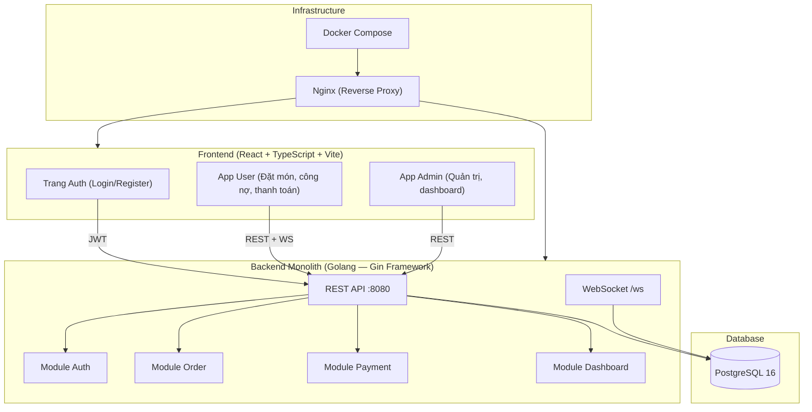

# 🏗️ Kiến Trúc Hệ Thống — Lunch Order System

## 1. Sơ đồ kiến trúc tổng thể

Kiến trúc mục tiêu là monolith backend có phân lớp rõ ràng theo module, kết hợp frontend route-based theo feature. Trong giai đoạn MVP, toàn bộ hệ thống chạy chung một backend Go và một frontend React, nhưng vẫn tách ranh giới Auth, Order, Payment và Dashboard để dễ mở rộng về sau.



---

## 2. Tech Stack

| Lớp | Công nghệ | Phiên bản | Ghi chú |
|-----|-----------|-----------|---------|
| Frontend | React + TypeScript | 18.x | Vite build tool |
| Styling | CSS Variables + Design System | — | Màu hồng & vàng nhạt |
| Backend | Golang (Gin) | 1.21+ | REST API + WebSocket |
| Database | PostgreSQL | 16 | GORM ORM |
| Auth | JWT (golang-jwt/jwt) | v5 | Access token |
| Realtime | WebSocket (gorilla/websocket) | v1.5 | Push thông báo đơn hàng, payment |
| Container | Docker + Docker Compose | 24.x | 3 services: fe, be, db |
| Reverse Proxy | Nginx | Alpine | Port 80 → fe, /api → be |

---

## 3. Quyết Định Kiến Trúc (ADR)

| # | Quyết định | Lý do | Phương án thay thế |
|---|-----------|-------|-------------------|
| 1 | Monolith backend theo module (không microservice) | Phù hợp quy mô nội bộ, dễ triển khai và bảo trì | Microservice (phức tạp hơn) |
| 2 | Frontend route-based theo feature | Dễ tách màn hình, dễ giao việc FE | Micro-frontend |
| 3 | PostgreSQL thay vì MongoDB | Dữ liệu có quan hệ rõ ràng (user, order, debt, payment) | MongoDB |
| 4 | JWT stateless thay vì session | Dễ scale, frontend lưu token local | Redis session |
| 5 | WebSocket thuần thay vì SSE | Cần 2 chiều (server push + client ack) | Server-Sent Events |
| 6 | Vite thay vì CRA | Build nhanh hơn, HMR tốt hơn | Create React App |
| 7 | Nginx làm reverse proxy đầu vào | Chuẩn hóa route frontend/backend, dễ vận hành Docker Compose | Truy cập trực tiếp từng service |

---

## 4. Cấu Trúc Thư Mục Chuẩn

### Backend

```
backend/
├── main.go                 ← Entry point
├── config/                 ← Đọc env, cấu hình app
├── db/                     ← Kết nối DB, AutoMigrate
├── internal/
│   ├── handlers/           ← HTTP handlers (controller)
│   ├── middleware/         ← JWT auth, role check
│   ├── models/             ← GORM models (struct DB)
│   ├── services/           ← Business logic theo module
│   └── websocket/          ← WebSocket hub & client
└── pkg/                    ← Utility packages
```

### Frontend

```
frontend/src/
├── api/                    ← Axios instances, API calls
├── components/             ← Shared UI components
├── features/               ← Feature-based modules
│   ├── auth/               ← Login, Register
│   ├── order/              ← Đặt món, giỏ hàng, my orders
│   ├── payment/            ← Thanh toán QR, debt
│   └── admin/              ← Quản trị, dashboard
├── hooks/                  ← Custom React hooks
├── store/                  ← State management (Zustand/Context)
├── types/                  ← TypeScript interfaces
└── styles/                 ← Design tokens, global CSS
```

---

## 5. Giao Thức Giao Tiếp

| Từ | Đến | Giao thức | Ghi chú |
|----|-----|-----------|---------|
| Frontend | Backend | REST (HTTP/HTTPS) | Mọi CRUD operation |
| Frontend | Backend | WebSocket `/ws` | Nhận thông báo realtime |
| Backend | PostgreSQL | TCP (GORM) | Query & mutation |
| Nginx | Frontend | HTTP proxy | Port 80 → frontend |
| Nginx | Backend | HTTP proxy | `/api` → 8080 |

---

## 6. Môi Trường

| Biến | Mô tả | Giá trị mặc định |
|------|-------|-----------------|
| `DB_HOST` | Host PostgreSQL | `db` (Docker) / `localhost` (local) |
| `DB_PORT` | Port PostgreSQL | `5432` |
| `DB_NAME` | Tên database | `lunchorder` |
| `DB_USER` | Username DB | `postgres` |
| `DB_PASSWORD` | Password DB | *(xem .env)* |
| `JWT_SECRET` | Khóa ký JWT | *(xem .env)* |
| `PORT` | Port backend | `8080` |
| `COMPANY_SUBSIDY` | Mức hỗ trợ (VND) | `30000` |

---

## 7. Ghi chú triển khai

- Backend hiện là một khối triển khai duy nhất nhưng cần giữ ranh giới module rõ ràng trong code.
- Frontend được chia theo feature/route để dễ mở rộng sau này.
- Dashboard đọc dữ liệu tổng hợp từ backend monolith, không tách service riêng ở MVP.
- Realtime dùng WebSocket cho các sự kiện đơn hàng và thanh toán.

---

*Cập nhật lần cuối: 2026-04-23*
